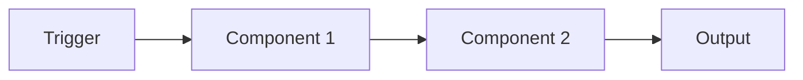
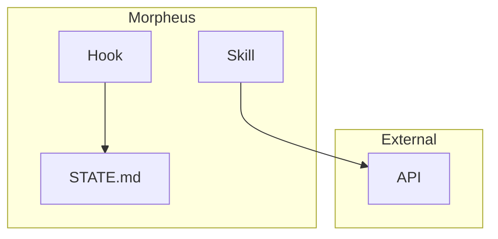
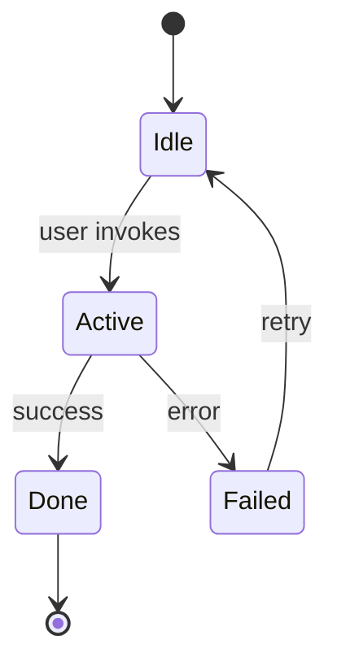

# {Feature Name}

> **One-sentence elevator pitch.** Replace this line with what this feature is + why it exists in one sentence.

## Overview

**What it is**: 2-3 sentences describing the feature in plain language.

**Why it exists**: 2-3 sentences on the problem it solves. Reference the motivating incident, constraint, or Tyler-Goodwin context if applicable.

**Who uses it**: Who invokes this — Tyler directly, an agent on Tyler's behalf, a hook automatically, a teammate?

**Status**: One of `draft` (design in progress), `active` (production-ready), `deprecated` (being replaced — link replacement), `archived` (kept for history only).

## Architecture

Describe how the feature is structured. Use Mermaid diagrams for anything with multiple components, flows, or state transitions. Inline ASCII is acceptable for tiny things (2-3 boxes) but Mermaid is preferred.

### High-level flow



Narrate the diagram in 2-4 sentences after the block. Explain what happens at each node and what the edges represent.

### Topology (if applicable)



Use subgraphs to show trust boundaries, network boundaries, or layer separation.

### State transitions (if applicable)



## User flows

Describe the most common user journeys with concrete step-by-step walkthroughs. Include commands, expected output, and what to do if something goes wrong.

### Flow 1: {primary flow name}

**Goal**: one sentence.

**Steps**:
1. Tyler runs `{command}` with `{arguments}`.
2. Morpheus does X (pointer to which component handles this).
3. Output lands at `{path}`.
4. Tyler verifies by `{verification step}`.

**Example**:
```bash
# paste a real example
{command} {args}
```

**Expected result**:
```
{output shape}
```

### Flow 2: {secondary flow name}

Same structure. Add as many flows as there are distinct user intents.

## Configuration

Enumerate every config file, environment variable, secret, or setting the feature touches.

| Path / Variable | Purpose | Default | Required? |
|-----------------|---------|---------|-----------|
| `{config/path.json}` | What it controls | `{default}` | yes / no |
| `{ENV_VAR}` | What it sets | `{default}` | yes / no |

### First-time setup

If the feature requires bootstrapping (config file creation, API keys, cert import, etc.), walk through it here. The goal is: a teammate forking Morpheus should be able to get this feature working from scratch in under 15 minutes using only this section.

## Integration points

How does this feature touch the rest of Morpheus?

| Touches | How | Files |
|---------|-----|-------|
| CLAUDE.md | Skill registered in the skills table | `CLAUDE.md` |
| Daily note | Logs timeline entries on invocation | `.claude/rules/daily-note.md` |
| STATE.md | Reads/writes task state | `hub/staging/*/STATE.md` |
| INDEX.md | Artifacts auto-indexed on write | `INDEX.md` |

Include a Mermaid diagram if the integration web is non-trivial.

## Troubleshooting

**Dedicated runbook**: `{link to docs/reference/*-runbook.md}` (if one exists — otherwise delete this line and write inline troubleshooting below).

### Common failure modes

| Symptom | Likely cause | Fix |
|---------|-------------|-----|
| {what user sees} | {why} | {what to do} |

## References

- **Source code**: link to primary implementation files
- **Related ADRs**: `docs/decisions/ADR-NNN-*.md`
- **Upstream API docs**: external URLs with access dates
- **Related STATE.md**: `hub/staging/{task-id}/STATE.md` — the build history
- **Related research**: `hub/staging/{task-id}/research-*.md` — design rationale

## Changelog

| Timestamp | Project | Agent | Change |
|-----------|---------|-------|--------|
| {YYYY-MM-DD}T{HH:MM} | {task-id or "maintenance"} | {author} | {what changed} |

<!--
  Template notes (delete this block in real docs):
  - Keep diagrams small. Multiple 3-5 node diagrams beat one 20-node diagram.
  - Prose AFTER each diagram is mandatory — a diagram without narration is ambiguous.
  - Every User Flow needs a real example, not a placeholder.
  - Configuration table: list every path a teammate would need to edit. Hidden config = future support ticket.
  - Integration points: if the feature is truly self-contained, write "Self-contained — no integration points." Do not leave the section blank.
  - Changelog: max 10 entries, newest first. When you reach 10, delete the oldest.
-->
