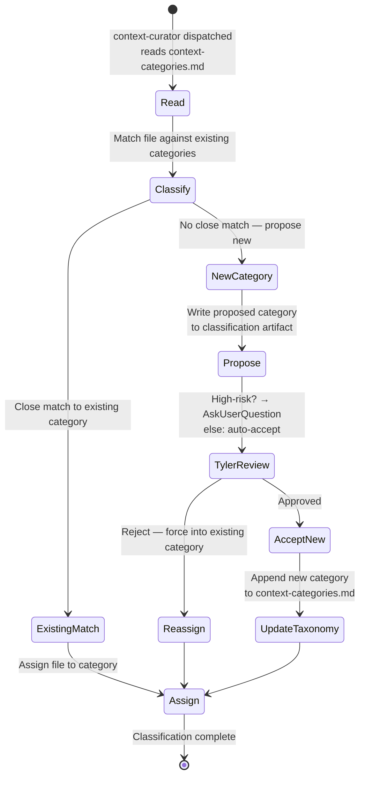
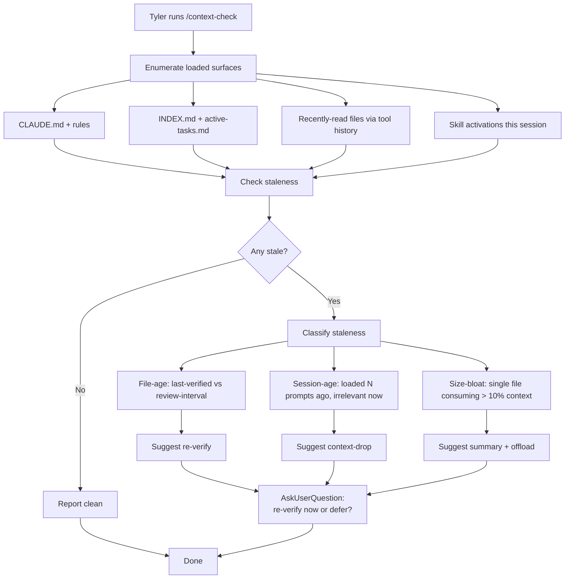

# Context Engineering

> **How Morpheus manages its own context window — /context-check for health assessment, /ingest-context for processing the drop-zone with classification and approval gates.**

## Overview

**What it is**: Two interlocking subsystems. `/ingest-context` is the processing pipeline for files Tyler drops into `ingest/` — dedup via SHA256 hash comparison, classification via the `context-curator` agent against a persistent taxonomy (`hub/state/context-categories.md`), rename to slug form, archive to `hub/context-log/`, log to `ingest-hashes.log` + daily note. High-risk cascades (mass renames, destructive ops, security-sensitive actions) route through daily note Approvals Pending rather than executing inline. `/context-check` is the on-demand health assessor for the currently-loaded context — enumerates loaded surfaces, flags staleness (file-age, session-age, size-bloat), suggests cleanup via AskUserQuestion.

**Why it exists**: LLM context is finite and expensive. Without an ingest pipeline, dropping N files eats context unpredictably. Without a persistent taxonomy, each classification is ad-hoc and the same kind of file gets labeled three different ways across sessions. Without approval gates, a context-curator could silently apply mass renames that break existing references. And without `/context-check`, a long session accumulates stale files loaded 50 prompts ago that still consume tokens but no longer matter. The two skills together encode three safeguards: curated intake, taxonomy discipline, and context health visibility.

**Who uses it**: `/ingest-context` auto-fires when Tyler drops files in `ingest/` — the `prompt-context-loader.sh` hook uses a forced-YES override so the skill activates even when its trigger patterns wouldn't match. `/context-check` is on-demand — Tyler invokes when a session feels bloated or before starting a context-sensitive task. The `context-curator` agent is invoked by `/ingest-context` per classification and owns writes to `hub/state/context-categories.md`.

**Status**: `active` — ingest pipeline production since 2026-04-09; context-curator agent + persistent taxonomy added 2026-04-09; `/context-check` on-demand surface stable.

## Architecture

Context engineering in Morpheus is two interlocking subsystems: `/ingest-context` is the processing pipeline for files Tyler drops into `ingest/`, and `/context-check` is the on-demand health assessor for what's currently loaded into the main session. The pipeline has a persistent taxonomy (`hub/state/context-categories.md`) managed by the `context-curator` agent, a dedup log (`hub/state/ingest-hashes.log`), and an archive (`hub/context-log/`). High-risk cascades (mass renames, destructive ops, security-context-sensitive actions) are routed through daily note Approvals Pending rather than executed inline.

### /ingest-context pipeline

```mermaid
flowchart LR
  A[Tyler drops N files<br/>in ingest/] --> B[prompt-context-loader hook<br/>forced-YES override]
  B --> C[/ingest-context auto-fires]
  C --> D[Step 1: Dedup<br/>hash each file<br/>compare to ingest-hashes.log]
  D --> E{Already<br/>processed?}
  E -->|yes| F[Skip + log skipped-hash]
  E -->|no| G[Step 2: Classify<br/>dispatch context-curator agent<br/>reads context-categories.md taxonomy]
  G --> H[Step 3: Rename<br/>to slug-style filename<br/>based on classification]
  H --> I[Step 4: Archive<br/>move ingest/x.md → hub/context-log/YYYY-MM-DD-slug.md]
  I --> J[Step 5: Log<br/>append to ingest-hashes.log<br/>append timeline entry to daily note]
  J --> K{High-risk<br/>cascade?}
  K -->|no| L[Done]
  K -->|yes| M[AskUserQuestion:<br/>Apply now / Defer / Deny]
  M -->|Apply| N[Execute cascade inline]
  M -->|Defer| O[Write to daily note<br/>## Approvals Pending<br/>unchecked box]
  M -->|Deny| P[Log ✗ to Approvals Log<br/>halt]
  N --> L
  O --> L
  P --> L
```

**What happens**: Dropping files in `ingest/` triggers the pipeline passively — `prompt-context-loader.sh` forces `/ingest-context` to YES on the next prompt even if the skill evaluation wouldn't have activated it. Dedup happens first (hash-based, SHA256) to prevent reprocessing a file that's already been archived. Classification is dispatched to the `context-curator` agent, which reads `hub/state/context-categories.md` (the persistent taxonomy), decides a category, and either assigns to an existing one or creates a new one — this is how the taxonomy evolves. Rename + archive + log are mechanical. High-risk cascades (anything that would rename files outside `ingest/`, modify `hub/` state beyond the curator's write surface, or touch security-sensitive paths) get an explicit AskUserQuestion — Tyler must approve inline or defer. Deferred cascades land in the daily note's `## Approvals Pending` section, processed later via `/approve-pending`.

### Taxonomy evolution via context-curator



**What happens**: Every classification dispatch reads the current taxonomy, attempts match against existing categories, and either (a) assigns to an existing category, (b) proposes a new category if no close match exists. The taxonomy is append-only at the category level — old categories don't get retroactively renamed when new ones land. High-risk proposals (e.g., a new category that would reclassify dozens of existing files) trigger AskUserQuestion; routine proposals (narrow new category, affects only the current file) auto-accept. This keeps the taxonomy evolving without drift and without requiring Tyler to bless every micro-category.

### /context-check decision tree



**What happens**: `/context-check` is on-demand, not auto-fired. It enumerates what's currently loaded into the main session (core files via CLAUDE.md + rules, auto-indexed via INDEX.md, recently-read via tool history, skill-activated), checks each for three staleness signals (file-age per frontmatter, session-age relative to current relevance, size-bloat eating context), and suggests cleanup actions. It never auto-cleanups — always AskUserQuestion before unloading anything. The goal is to prevent context rot on long sessions where files loaded 50 prompts ago are still consuming tokens but no longer relevant.

### Plan-first scaffolding, JIT retrieval, and meta-improvement context

The 2026-04-22 overhaul added three new context-engineering patterns that extend the original ingest + health-check model.

**Plan-first, post-approval scaffolding (invariant #2 in north-star-standard.md)**

Before the v2 overhaul, Morpheus could write STATE.md and create session tasks before Tyler had seen the orchestration plan. This polluted the context window with artifacts from a plan that might change. The plan-first invariant (rule 12 in `/the-protocol`) gates ALL writable side effects (staging dir, STATE.md, Planner task, TaskCreate, daily-note entry) behind `ExitPlanMode` + Tyler approval. Scope classification and context gathering happen pre-approval; nothing durable is written pre-approval. This keeps the context window clean during the planning phase — only read-only context loads before the plan is approved.

**Just-in-time retrieval: /the-protocol Step 6b scales context loading by scope**

`/the-protocol` Step 6b governs how much context is loaded for the orchestration plan. Loading the entire project corpus for a Passthrough question wastes tokens; loading only a summary for an Ultra task causes context gaps. The JIT retrieval pattern scales context loading to scope:
| Scope | Context budget target | What gets loaded |
|-------|----------------------|-----------------|
| Passthrough | ~500 tokens | CLAUDE.md + active-tasks.md (already in context from session start) |
| Mini / Small | ~500-1K tokens | Same; plus INDEX.md section if file discovery needed |
| Medium | ~2K tokens | STATE.md frontmatter + relevant research artifact paths |
| Large | ~3K tokens | STATE.md (full) + relevant wave artifacts by path only |
| Ultra | ~4K tokens | STATE.md (full) + HANDOFF.md + relevant artifact paths |

The key principle is "pass paths, not contents" (CLAUDE.md context engineering rule #2): agents receive file paths, not file contents. They load files on demand via the Read tool, which keeps the orchestrator context lean and lets downstream agents load only what they need. This aligns with Anthropic's externalized-state pattern: keep durable state in files, rehydrate on demand.

**Meta-improvement context: replay corpus, audit ledger, episodic log, roadmap**

The v2 overhaul introduced four new artifacts that serve the meta-harness self-improvement loop rather than individual task execution:

- **`hub/state/harness-audit-ledger.md`** (append-only): one row per protocol invocation. Columns: timestamp, task-id, scope, AskUserQuestion-fired, EnterPlanMode-fired, ExitPlanMode-fired, Planner-task-created, overall-pass, violation-details. Written by `protocol-execution-audit.ps1`. Consumed by `/weekly-review` and `generate-harness-metrics.ps1`. This is the evidence base for measuring whether the harness is actually enforcing its invariants.
- **`hub/state/replay-corpus/`** (directory of canonical failure cases): one subdirectory per case, each containing a frozen transcript, expected protocol trace, observed trace, and delta analysis. The first entry is `2026-04-21-azure-kickoff-rubber-stamp/` — the Azure detection-engineering kickoff where Morpheus skipped four protocol steps. `replay-harness-case.ps1` uses these cases to regression-test proposed harness changes before they ship.
- **`hub/state/episodic-log.md`** (append-only): lightweight passive memory capture for Passthrough turns. When a Passthrough answer touches preferences, roadmap signals, or repeated-question patterns, `/the-protocol` appends a 1-line entry. `/weekly-review` consumes the episodic log to surface patterns that might warrant a new memory entry or skill.
- **`hub/state/roadmap.md`** (rolling): the project-level context artifact. Contains active and upcoming projects, priorities, and dependencies. Populated by `/weekly-review` and surfaced to the daily note by the session-start hook when items are stale or new. Represents the roadmap self-improvement loop (one of three loops in the north-star standard).

These four artifacts are never loaded wholesale into context — they are referenced by path and read on demand. The audit ledger and metrics are read by `/weekly-review`; the episodic log by pattern-detection runs; the roadmap by session start and plan creation. The replay corpus is only read during harness-change verification. None of these artifacts should be read during normal task execution.

## User flows

### Flow 1: Drop N files in ingest/ — auto-fire pipeline

**Goal**: process a batch of files Tyler just dropped without requiring a manual `/ingest-context` call.

**Steps**:
1. Tyler copies N files into `ingest/` (via file manager, scp, or CLI).
2. Next prompt fires — `prompt-context-loader.sh` detects unprocessed files (comparison against `ingest-hashes.log`) and forces `/ingest-context` to YES regardless of normal skill evaluation.
3. Pipeline runs: dedup (skip hashes already logged) → classify each file via context-curator → rename to `YYYY-MM-DD-{slug}.md` → archive to `hub/context-log/` → log to `ingest-hashes.log` + daily note timeline entry.
4. Any high-risk cascade (e.g., classification triggers a cross-file rename) fires AskUserQuestion inline — Tyler chooses Apply / Defer / Deny.
5. Deferred cascades land in daily note `## Approvals Pending` for later `/approve-pending` resolution.

**Example**:
```bash
# Tyler drops 12 PDF IR reports into ingest/
# Next prompt: "continue where we left off"
# → prompt-context-loader detects 12 unprocessed files
# → /ingest-context auto-fires
# → 12 files processed: 8 classified as incident-report, 3 as vendor-writeup, 1 flagged (unclear category)
# → 1 AskUserQuestion for the ambiguous file; Tyler picks vendor-writeup
# → 12 files archived to hub/context-log/2026-04-21-{slug}.md
# → Daily note timeline entry: "Ingested 12 files, 8+3+1 distribution"
```

**Expected result**: `ingest/` is empty (or contains only skipped-hash files); `hub/context-log/` has 12 new named files; daily note has a timeline entry with classification distribution; no high-risk cascades executed without Tyler approval.

### Flow 2: /context-check mid-session

**Goal**: mid-session health check to see what's loaded and whether any of it should be unloaded to free context.

**Steps**:
1. Tyler runs `/context-check` (typically when a session starts feeling slow or before a context-sensitive task).
2. Skill enumerates loaded surfaces: CLAUDE.md + rules auto-loaded, INDEX.md + active-tasks.md from session start hook, files read via Read tool, skills activated this session.
3. For each surface, compute staleness: file-age (last-verified frontmatter + review-interval), session-age (how long ago loaded + relevance score), size-bloat (surface consuming >10% context).
4. Report findings: total surfaces loaded, approximate context footprint, stale candidates with reasons.
5. For each stale candidate, AskUserQuestion: re-verify now / unload / keep.
6. Apply Tyler's choices; never auto-unload.

**Example**:
```bash
/context-check
# → 47 surfaces loaded (approx 18% of context window)
# → 3 stale candidates:
#   • hub/staging/2026-03-20-old-task/STATE.md (loaded 60+ prompts ago, task completed)
#   • knowledge/security/sentinel-kql-basics.md (last-verified 180d ago, 90d interval)
#   • research/large-artifact.md (consuming ~4% context alone)
# → AskUserQuestion per candidate → unload / re-verify / keep
```

**Expected result**: clearer picture of context footprint; explicit Tyler choices for stale candidates; no silent unloads; session continues with lighter context.

### Flow 3: High-risk cascade — deferred to Approvals Pending

**Goal**: safely defer a cascade that affects many files outside `ingest/`, so Tyler can review the full scope before approving.

**Steps**:
1. During `/ingest-context` pipeline, context-curator proposes a classification that would cascade: e.g., "all 47 existing files under `knowledge/incidents/` should be reclassified from `incident` → `ir-case` to match the new taxonomy."
2. Pipeline detects this is high-risk (affects >5 files OR touches `knowledge/` OR touches security-sensitive paths).
3. AskUserQuestion fires: Apply now / Defer / Deny — with a preview of the affected files.
4. On Defer: write an unchecked `- [ ] High-risk cascade: {description} (task: <id>)` entry to daily note `## Approvals Pending`.
5. Pipeline continues without executing the cascade; other files in the batch process normally.
6. Later, Tyler runs `/approve-pending` — the deferred cascade re-prompts; Tyler chooses final action; receipt lands in original-day's `## Approvals Log` with both timestamps preserved.

**Example**:
```bash
# /ingest-context batch of 5 files
# 4 process cleanly; 1 triggers cascade proposal (affects 47 knowledge/ files)
# AskUserQuestion: Apply now / Defer / Deny
# Tyler chooses "Defer" — entry written to today's Approvals Pending
# 2 days later, Tyler reviews the 47-file list → runs /approve-pending → chooses Apply
# → 47 files renamed; receipt in original day's Approvals Log
```

**Expected result**: high-risk cascade never executes silently; Tyler has 2-day decision window if he wants; audit trail preserved across days via immutable Approvals Log.

## Configuration

| Path / Variable | Purpose | Default | Required? |
|-----------------|---------|---------|-----------|
| `ingest/` | Drop zone for raw files Tyler wants processed | auto-created | yes |
| `hub/state/context-categories.md` | Persistent taxonomy (append-only at category level; managed by context-curator) | seeded empty | yes |
| `hub/state/ingest-hashes.log` | Dedup history — SHA256 per processed file | grows via pipeline | yes |
| `hub/context-log/YYYY-MM-DD-{slug}.md` | Archive of ingested + classified files | grows via pipeline | yes |
| `hub/templates/classification-artifact.md` | Classification output template (for context-curator writes) | — | yes |
| `.claude/commands/ingest-context.md` | Skill orchestrating the pipeline | — | yes |
| `.claude/commands/context-check.md` | On-demand context health assessor | — | yes |
| `.claude/agents/context-curator.md` | General-purpose classifier agent with persistent taxonomy | — | yes |
| `.claude/hooks/prompt-context-loader.sh` | Auto-fires /ingest-context when `ingest/` has unprocessed drops | forced-YES override | yes |
| `hub/state/harness-audit-ledger.md` | Append-only protocol-invocation audit log; written by protocol-execution-audit.ps1 | grows via hook | yes |
| `hub/state/episodic-log.md` | Passive memory capture for Passthrough signals; consumed by /weekly-review | grows via /the-protocol Passthrough path | yes |
| `hub/state/roadmap.md` | Project-level context; rolling project list + priorities | populated by /weekly-review + session start | yes |
| `hub/state/replay-corpus/` | Canonical failure cases for harness regression testing | grows with new failures | yes |

### Classification-artifact structure

`hub/templates/classification-artifact.md` defines the per-file output the context-curator writes. Each classification records: file hash, proposed slug, chosen category (existing or new), confidence level, and notes on edge cases. This artifact trail is how the pipeline is audited — any reclassification or drift diagnosis starts from here.

## Integration points

| Touches | How | Files |
|---------|-----|-------|
| prompt-context-loader hook | Auto-fires `/ingest-context` on unprocessed files in `ingest/` via forced-YES override | `.claude/hooks/prompt-context-loader.sh` |
| context-curator agent | Dispatched per-file by `/ingest-context` for taxonomy-aware classification | `.claude/agents/context-curator.md` |
| Daily note | Deferred high-risk cascades land in `## Approvals Pending`; timeline entries per processed batch | `.claude/rules/daily-note.md`, `notes/YYYY/MM/YYYY-MM-DD.md` |
| /approve-pending | Resolves deferred cascade approvals (Apply / Deny / Defer) | `.claude/commands/approve-pending.md` |
| CLAUDE.md | Rule 10 — files in `ingest/` are automatically processed; no manual `/ingest-context` call needed | `CLAUDE.md` § Context Engineering Rules |
| INDEX.md | Archived files get auto-indexed via `update-index.sh` PostToolUse hook | `INDEX.md`, `.claude/hooks/update-index.sh` |
| Task state management | Cascade approvals reference task IDs via `(task: <id>)` | `docs/morpheus-features/task-state-management.md` |
| Protocol audit hook | `protocol-execution-audit.ps1` detects context-engineering violations (missing plan-first, skipped gates); writes to audit ledger | `.claude/hooks/protocol-execution-audit.ps1`, `hub/state/harness-audit-ledger.md` |
| /weekly-review | Consumes episodic-log.md + harness-metrics.md to surface meta-improvement patterns | `hub/state/episodic-log.md`, `hub/state/harness-metrics.md` |

## Troubleshooting

| Symptom | Likely cause | Fix |
|---------|-------------|-----|
| Same file processed twice despite being in `ingest-hashes.log` | Dedup collision — file was modified trivially (whitespace, BOM, timestamp metadata) producing a new SHA256 | Check both hashes against `ingest-hashes.log`. If the content is semantically identical but hashes differ, diff at byte level (`hexdump -C` both files; look for BOM, line endings, trailing whitespace). Normalize before re-hashing: `dos2unix` + strip BOM + trim trailing whitespace. Add the normalized hash to the log to catch future trivial variations. |
| context-curator picked a category that doesn't fit | Classification misfire — taxonomy match was shallow or ambiguous | Review the classification artifact at `hub/context-log/YYYY-MM-DD-{slug}.md` (header includes chosen category + confidence). To reclassify: move the archive file manually, update `ingest-hashes.log` if needed, and optionally update `hub/state/context-categories.md` to sharpen the category definition so future classifications disambiguate better. Don't retroactively rename existing archived files unless consistency is critical. |
| Deferred approval sitting in Pending for days | Stuck approval — Tyler forgot to run `/approve-pending`, or the cascade affects too many files to decide quickly | Daily `/eod` summary surfaces pending approvals. For very large cascades, break them into smaller chunks — re-raise N smaller proposals instead of one big one, each individually approvable. If a cascade is permanently abandoned, manually move from Approvals Pending to Approvals Log with ✗ and a note. |
| Two very similar categories in `context-categories.md` | Taxonomy drift — context-curator created `security-incident` and `ir-case` as separate categories when they should be one | Consolidation is a Tyler-driven cleanup. Pick the canonical name; update `context-categories.md` to merge (remove the duplicate and add a note). Then manually reclassify affected archive files (not strictly required — they can retain old category labels for historical accuracy). Prevent recurrence: strengthen category definitions in `context-categories.md` so the curator's next match has more semantic anchor. |
| `/context-check` says surface is stale but it's still being used | False positive on session-age — loaded long ago but actively relevant | Answer "keep" at the AskUserQuestion prompt; `/context-check` is advisory, never auto-unloads. If this happens often, the session-age heuristic is too aggressive — consider tracking last-read-time per surface instead of load-time. |
| `/ingest-context` doesn't auto-fire despite files in `ingest/` | `prompt-context-loader.sh` forced-YES override failed — usually the hook stderr got swallowed | Run `bash .claude/hooks/prompt-context-loader.sh` manually; check stderr. Verify `ingest/` has read permissions and files aren't all already in `ingest-hashes.log`. Run `/ingest-context` manually as fallback. |

## References

**Skills**:
- [`.claude/commands/ingest-context.md`](../../.claude/commands/ingest-context.md) — pipeline orchestrator
- [`.claude/commands/context-check.md`](../../.claude/commands/context-check.md) — on-demand health assessor
- [`.claude/commands/approve-pending.md`](../../.claude/commands/approve-pending.md) — resolves deferred cascades

**Agents**:
- [`.claude/agents/context-curator.md`](../../.claude/agents/context-curator.md) — persistent-taxonomy classifier

**State + templates**:
- [`hub/state/context-categories.md`](../../hub/state/context-categories.md) — persistent taxonomy
- [`hub/state/ingest-hashes.log`](../../hub/state/ingest-hashes.log) — dedup history
- [`hub/context-log/`](../../hub/context-log/) — archive
- [`hub/templates/classification-artifact.md`](../../hub/templates/classification-artifact.md) — classifier output template
- [`hub/state/harness-audit-ledger.md`](../../hub/state/harness-audit-ledger.md) — protocol invocation audit log
- [`hub/state/episodic-log.md`](../../hub/state/episodic-log.md) — Passthrough signal capture
- [`hub/state/roadmap.md`](../../hub/state/roadmap.md) — project-level context (rolling)
- [`hub/state/replay-corpus/`](../../hub/state/replay-corpus/) — canonical failure cases for harness regression

**Hooks**:
- [`.claude/hooks/prompt-context-loader.sh`](../../.claude/hooks/prompt-context-loader.sh) — forced-YES override for unprocessed drops

**Related feature docs**:
- [`docs/morpheus-features/hooks-framework.md`](hooks-framework.md) — prompt-context-loader registration
- [`docs/morpheus-features/daily-notes-system.md`](daily-notes-system.md) — Approvals Pending surface for deferred cascades
- [`docs/morpheus-features/task-state-management.md`](task-state-management.md) — approval lifecycle + task ID refs
- [`docs/morpheus-features/north-star-standard.md`](north-star-standard.md) — plan-first invariant + JIT retrieval pattern this feature implements

## Changelog

| Timestamp | Project | Agent | Change |
|-----------|---------|-------|--------|
| 2026-04-22 | 2026-04-22-harness-intake-improvements | documenter | v2 overhaul update: added Plan-first/JIT/meta-improvement architecture subsection (plan-first invariant, Step 6b scope-scaled context-loading table, 4 meta-improvement artifacts); expanded Configuration to 13 rows (added harness-audit-ledger, episodic-log, roadmap, replay-corpus); added 2 integration point rows; expanded State refs with 4 new entries; added north-star to related docs. |
| 2026-04-21 | 2026-04-17-feature-docs-prose-fill | morpheus | Filled skeleton to active: 3 Mermaid (/ingest-context pipeline, taxonomy evolution stateDiagram, /context-check decision tree), Config expanded to 9 rows + classification-artifact paragraph, Integration points to 7 rows, 3 user flows (drop-N-files, mid-session health check, high-risk cascade defer) with full Goal/Steps/Example/Expected, 6-row troubleshooting covering dedup/classification/approval/drift/false-positive/auto-fire-failure, References split into 5 named subsections. |
| 2026-04-17T11:00 | 2026-04-17-morpheus-feature-docs | morpheus | Skeleton created via /document-feature audit consolidation — prose TODO |
