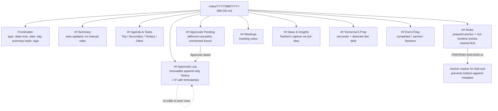
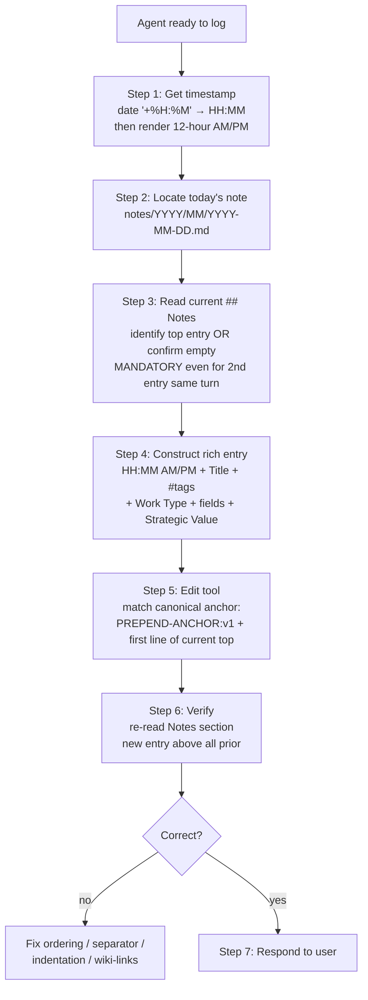

# Daily Notes System

> **Structured daily work log with rich timeline entries, approval workflows, prepend-only ordering, and aggregated weekly/monthly rollups.**

## Overview

**What it is**: The narrative timeline of every Morpheus session and Tyler's work between sessions. A daily note at `notes/YYYY/MM/YYYY-MM-DD.md` has nine strictly-ordered sections (Summary, Agenda & Tasks, Notes, Approvals Pending, Approvals Log, Meetings, Ideas & Insights, Tomorrow's Prep, End of Day), rich timeline entries prepended newest-first via an anchor comment, and approval workflows that write to dedicated sections with immutability rules. The system rolls up automatically to weekly (`YYYY-W##.md`), monthly (`YYYY-MM.md`), quarterly (`YYYY-Q#.md`), and yearly (`YYYY.md`) aggregates. Eight skills cover the full lifecycle (create, read, write, checkpoint, end-of-day, weekly-review, jot-idea, catch-up).

**Why it exists**: STATE.md captures task-level state but is too granular and task-focused to review a day at a glance. Daily notes are the narrative glue between Tyler and Morpheus — the single surface where Tyler can see "what happened today" without reading diffs or walking through N staging directories. They also make pattern detection possible: `/weekly-review` aggregates 5 daily notes into automation candidates, repeated manual steps, and skill-opportunity signals. Without daily notes there's no shared narrative surface between human and agent, and no aggregation input for weekly pattern detection.

**Who uses it**: Tyler reads the daily note throughout the day (especially `/read-today` at session start) and writes to it via `/jot-idea`. Every Morpheus skill logs timeline entries per Gate 4 — daily note logging is IMMEDIATE, never deferred. Hooks write to the note passively: `ensure-note.sh` at SessionStart, `daily-note-watch.sh` on approval checkbox toggles, `daily-note-check.ps1` at Stop, `note-summary-updater.ps1` maintains the Summary section.

**Status**: `active` — production since initial Morpheus build (2026-03-30); format revised 2026-04-09 (12-hour AM/PM, natural title-case Work Type, vertical bullet lists); prepend anchor added 2026-04-09.

## Architecture

Daily notes are the narrative timeline of every Morpheus session and Tyler's work between sessions. A note file at `notes/YYYY/MM/YYYY-MM-DD.md` has a strict section structure, timeline entries prepended newest-first via an anchor comment, approval workflows that write to dedicated sections, and automated rollup into weekly / monthly / quarterly / yearly aggregate notes. Supporting skills cover creation (`/create-daily-notes`), reading (`/read-today`, `/catch-up`), writing (`/daily-note-management`, `/jot-idea`), wrapping (`/eod`), and aggregating (`/weekly-review`).

### Daily note lifecycle

```mermaid
flowchart LR
  A[SessionStart hook] --> B[ensure-note.sh]
  B --> C{Today exists?}
  C -->|no| D[Create from hub/templates/daily-note.md<br/>+ weekly/monthly/quarterly/yearly if missing]
  C -->|yes| E[Skip — idempotent]
  D --> F[Roll yesterday's<br/>uncompleted priorities]
  E --> G[Session active]
  F --> G

  G --> H[Work happens]
  H --> I[Prepend timeline entry<br/>per Gate 4]
  I --> H

  G --> J[End of session]
  J --> K{/eod run?}
  K -->|yes| L[Update Summary<br/>consolidate priorities<br/>surface pending changes]
  K -->|no| M[Stop hook:<br/>daily-note-check.ps1<br/>flags missing EOD]

  L --> N[Monday 08:00?]
  N -->|yes| O[/weekly-review<br/>aggregates last 5 daily notes<br/>into 2026-W## pattern report]
```

**What happens**: `ensure-note.sh` runs at every SessionStart and is idempotent — if today's note exists, it skips (no overwrite). If missing, it copies `hub/templates/daily-note.md` and also ensures the containing weekly/monthly/quarterly/yearly notes exist. Task rollover pulls yesterday's unchecked priorities into today's Secondary/Tertiary/Other buckets. During the session, every significant work item prepends a timeline entry to `## Notes` (newest first, enforced by prepend protocol — see third diagram). `/eod` wraps the day: updates Summary, consolidates priorities, surfaces uncommitted changes. If `/eod` wasn't run, the Stop hook `daily-note-check.ps1` flags the missing EOD entry. Weekly rollup runs via `/weekly-review` (manual, typically Mondays).

### Section invariants — canonical structure



**What happens**: Nine sections in strict order. Agents must never reorder, rename, or merge sections. `## Summary` is auto-updated by a background script (note-summary-updater.ps1) — manual edits get overwritten. `## Notes` is where rich timeline entries land, always prepended via the anchor comment (see next diagram). `## Approvals Pending` is the deferred queue with unchecked boxes (Claude never checks boxes — only Tyler does). `## Approvals Log` is append-only history with immutable rows; new decisions prepend, but prior rows never edit. `## Tomorrow's Prep` is the idempotent sink for todo items the hooks surface (e.g., `feature-change-detector.sh` appends doc-debt items here). Retrofitting older notes (pre-2026-04-09) that lack Approvals sections is a separate protocol — insert between Notes and Meetings, leave empty unless a specific deferred item is being migrated.

### Prepend protocol for `## Notes`



**What happens**: Prepend is a 7-step protocol, strictly enforced. Step 3 (re-read the current top) is mandatory every single time — even for a second entry in the same turn — because file state can drift between Edits. The canonical anchor is a single HTML comment: `<!-- PREPEND-ANCHOR:v1 — insert new entries immediately below this line. ... -->`. Edits match against the anchor + the first bullet line of the current top entry; that pair is always uniquely resolvable. Common mistakes: appending instead of prepending, forgetting the `---` separator (must be at column 0, not indented), losing 2-space indentation on sub-content (breaks bullet grouping), prepending a second entry in a turn without re-reading. Legacy notes pre-2026-04-09 lack the anchor — flag for retrofit, don't backfill silently.

### Hooks that auto-prepend to the daily note

The 2026-04-22 overhaul added two new hooks that write protocol-violation entries directly to the daily note using the PREPEND-ANCHOR:v1 mechanism. These entries appear automatically without any skill invocation and are tagged to make them easy to filter in Obsidian or grep.

**`protocol-execution-audit.ps1`** (PostToolUse, Skill event): After each skill invocation, this hook reads `transcript_path` from the hook stdin JSON and parses recent conversation history for evidence of required protocol steps (AskUserQuestion, EnterPlanMode, ExitPlanMode, Planner task creation). When a required step is missing, it:
1. Writes a FAIL row to `hub/state/harness-audit-ledger.md`
2. Prepends a timeline entry to today's daily note tagged `#protocol-audit #violation` with the specific missed steps

The entry follows the PREPEND-ANCHOR:v1 prepend protocol from `.claude/rules/daily-note.md` and therefore lands at the top of `## Notes` with the correct timestamp. Example entry:

```markdown
- **02:30 PM** - **Protocol Audit: Violation Detected** #protocol-audit #violation

  **Work Type**: Harness Audit

  **Key Decisions**:
  - ⚠️ EnterPlanMode not called for Medium scope task — plan-first invariant violated
  - ⚠️ AskUserQuestion not detected in Step 6c — clarification gate skipped

  **Strategic Value**: Violation recorded in harness-audit-ledger.md. Review and address before next session.
```

**`state-frontmatter-validator.ps1`** (PostToolUse, Edit|Write event): After any Edit or Write targeting `hub/staging/*/STATE.md`, this hook parses the file's frontmatter and validates that all required v2 fields are present and typed correctly. When validation fails, it:
1. Writes a FAIL row to `hub/state/harness-audit-ledger.md`
2. Prepends a timeline entry to today's daily note tagged `#protocol-audit #violation` listing the specific missing or malformed fields

Both hooks are non-blocking — they do not prevent the triggering tool call from completing. They are informational surfaces that keep Tyler aware of harness-health issues without interrupting the work flow. The PREPEND-ANCHOR:v1 pattern ensures their entries land at the top of `## Notes` and respect the newest-first ordering invariant.

## User flows

### Flow 1: /read-today — load today's note with stats

**Goal**: get the current day's note into context at session start (or mid-session) to see what's been logged, what approvals are pending, and what priorities remain.

**Steps**:
1. Tyler runs `/read-today`.
2. Skill resolves `notes/YYYY/MM/YYYY-MM-DD.md` from current date.
3. Reads the full note into context.
4. Computes + displays stats: N timeline entries, N tasks (done / pending / rolled-over), N approvals (pending / applied / denied), N meetings.
5. Surfaces any `## Approvals Pending` items with a gentle reminder to run `/approve-pending` if Tyler wants to resolve.

**Example**:
```bash
/read-today
# → Today: 2026-04-20 Monday
#   • 7 timeline entries (oldest 08:15 AM, newest 02:55 PM)
#   • 3 approvals: 0 pending, 2 applied, 1 denied
#   • 5 meetings logged
#   • Priorities: 2 done / 3 pending / 1 rolled over from 2026-04-19
```

**Expected result**: today's note visible in context; stats give a one-glance sense of day progress; no writes.

### Flow 2: Morpheus auto-prepends a timeline entry after completing work (Gate 4)

**Goal**: document a completed work item in the daily note immediately, per Gate 4 (the #1 most-corrected Morpheus behavior).

**Steps**:
1. Morpheus completes a work item (tool sequence, skill execution, or explicit Tyler request).
2. **Immediately** (not at end of conversation, not batched), Morpheus prepends a timeline entry via the 7-step Prepend Protocol:
   a. Get timestamp: `date '+%H:%M'`, render as HH:MM AM/PM (12-hour).
   b. Read current `## Notes` section to identify top entry (mandatory every time).
   c. Construct rich entry with Work Type + fields + Strategic Value.
   d. Edit tool matches canonical anchor + first bullet of current top.
   e. Verify entry sits above all prior, separator intact, indentation preserved.
3. Respond to user only after the entry is written.

**Example**:
```markdown
- **02:55 PM** - **Feature Doc Written: Task State Management** #docs #morpheus-features

  **Work Type**: Documentation — Skeleton → Active (Phase 3 of 8)

  **Implementation Tasks**:
  - ✅ 3 Mermaid diagrams
  - ✅ 4 user flows with Goal/Steps/Example/Expected

  **Strategic Value**: Task state is the conceptual glue between orchestration and daily notes.
```

**Expected result**: timeline entry prepended above all prior; `## Notes` remains strictly newest-first; no orphan entries at bottom; no responses before the write completes.

### Flow 3: /eod — wrap the day

**Goal**: close out the day with a consolidated summary, refreshed priorities, and surfaced pending changes — without auto-committing anything.

**Steps**:
1. Tyler runs `/eod` when done for the day.
2. Skill re-reads today's note end-to-end.
3. Updates `## Summary` section (1-paragraph prose summary of the day's work, ~3-5 sentences).
4. Promotes / demotes priorities in `## Agenda & Tasks`: done items archived, unstarted items moved to `## Tomorrow's Prep` rollover.
5. Writes `## End of Day` block: completed / carried-forward / blockers.
6. Runs `git status --short` and surfaces uncommitted changes in the response text (categorized: framework-vs-personal) — **never auto-commits**.
7. Prepends an "EOD" timeline entry.

**Example**:
```bash
/eod
# → Summary updated
# → 3 priorities promoted, 2 rolled over
# → End of Day block written
# → Uncommitted: 4 framework files, 2 personal — review and commit manually
```

**Expected result**: clean day wrap; Summary + priorities + End of Day all current; no auto-commits; uncommitted changes clearly surfaced for Tyler's manual review.

### Flow 4: /weekly-review — aggregate 5 daily notes into pattern report

**Goal**: every Monday morning, aggregate the prior week's daily notes into a pattern report that drives priority updates and automation candidate detection.

**Steps**:
1. Tyler runs `/weekly-review` (or it runs manually Mondays 08:00).
2. Skill reads `notes/YYYY/MM/YYYY-MM-DD.md` for the 5 prior weekdays.
3. Extracts per-day: timeline entries (count + dominant tags), approvals (applied / denied), blockers.
4. Detects patterns: repeated manual workflows → candidate skill (feeds `/skill-opportunity-detector`), repeated corrections → candidate CLAUDE.md rule, stuck blockers → Tyler attention.
5. Writes aggregate to `notes/YYYY/YYYY-W##.md` (weekly rollup note).
6. Surfaces top 3 priorities for the new week + top 3 automation candidates.

**Example**:
```bash
/weekly-review
# Week 2026-W16 (5 notes, 47 timeline entries):
#   • Top tags: #planner (14), #docs (11), #morpheus-features (10)
#   • 8 approvals (all applied)
#   • Automation candidate: build-sign-test-deploy loop (8x, 5 sessions) — update /sign-script
#   • Priority for next week: finish feature-docs-prose-fill
```

**Expected result**: weekly rollup note written; patterns surfaced; priorities for next week updated in-place; automation candidates queued.

## Configuration

| Path / Variable | Purpose | Default | Required? |
|-----------------|---------|---------|-----------|
| `notes/YYYY/MM/YYYY-MM-DD.md` | Per-day note (primary file) | auto-created by ensure-note.sh | yes |
| `notes/YYYY/YYYY-W##.md` | Weekly aggregate | auto-created | yes |
| `notes/YYYY/YYYY-MM.md` | Monthly aggregate | auto-created | yes |
| `notes/YYYY/YYYY-Q#.md` | Quarterly aggregate | auto-created | yes |
| `notes/YYYY/YYYY.md` | Yearly aggregate | auto-created | yes |
| `hub/templates/daily-note.md` | Canonical daily note template | — | yes |
| `.claude/rules/daily-note.md` | Section invariants + approval lifecycle + prepend protocol (globs: notes/**) | — | yes |
| `scripts/utils/ensure-note.sh` | SessionStart — idempotent note creation + yesterday task rollover | — | yes |
| `scripts/utils/note-summary-updater.ps1` | Auto-updates `## Summary` section from `## Notes` content | — | yes |
| `.claude/hooks/daily-note-watch.sh` | PostToolUse — reacts to approval checkbox toggles | — | yes |
| `.claude/hooks/daily-note-check.ps1` | Stop — flags missing EOD entry | — | yes |
| `.claude/hooks/prepend-reminder.sh` | PreToolUse Edit|Write — reminds of prepend protocol anchor | — | yes |
| `.claude/hooks/protocol-execution-audit.ps1` | PostToolUse Skill — detects protocol-step violations; prepends `#protocol-audit #violation` entry to daily note | registered in settings.local.json | yes |
| `.claude/hooks/state-frontmatter-validator.ps1` | PostToolUse Edit|Write — validates STATE.md v2 frontmatter; prepends violation entry to daily note on failure | registered in settings.local.json | yes |

### Timeline entry format (strictly enforced)

| Field | Required? | Format |
|-------|-----------|--------|
| Header | yes | `- **HH:MM AM/PM** - **Title** #tag1 #tag2` (12-hour clock, natural title-case) |
| Work Type | yes | Natural title-case, e.g. `**Implementation Work**` (NOT bracketed all-caps) |
| Strategic Value | yes | Prose paragraph — why this matters |
| Implementation Tasks | optional | Bulleted ✅ list |
| Files Created / Modified | optional | Bulleted 📝 / 🔧 list, one per line (NOT inline pipe-separated) |
| Key Decisions | optional | Varied emojis per decision type (💡 🎯 ⚠️ 🔍) |
| Implementation Results | optional | Measurable outcomes |
| Deliverables / Artifacts | optional | Wiki-linked named outputs |
| Roadblocks | optional | Bulleted 🚧 list |

Mandatory blank lines between fields (without them, renderers collapse the entry to a run-on paragraph). `---` separator at column 0 between entries, preceded by a blank line.

## Integration points

| Touches | How | Files |
|---------|-----|-------|
| SessionStart hook | `ensure-note.sh` creates today + weekly/monthly/quarterly/yearly + rolls yesterday's priorities | `scripts/utils/ensure-note.sh`, `.claude/settings.local.json` |
| PostToolUse hook | `daily-note-watch.sh` reacts to approval checkbox toggles (auto-fires `/approve-pending`) | `.claude/hooks/daily-note-watch.sh` |
| PreToolUse hook | `prepend-reminder.sh` sanity-checks that an Edit targets the prepend anchor when editing `notes/**` | `.claude/hooks/prepend-reminder.sh` |
| Stop hook | `daily-note-check.ps1` flags missing EOD entry for the day | `.claude/hooks/daily-note-check.ps1` |
| Every Morpheus skill | Logs timeline entries per Gate 4 (daily note logging is IMMEDIATE, never deferred) | `CLAUDE.md` Gate 4, `.claude/rules/hub.md` |
| Approvals workflow | `/ingest-context` defers high-risk cascades; `/approve-pending` resolves them | `docs/morpheus-features/context-engineering.md`, `docs/morpheus-features/task-state-management.md` |
| Weekly / monthly / quarterly / yearly rollup | `/weekly-review` aggregates 5 daily notes; Obsidian dataview queries render rollups | `.claude/commands/weekly-review.md`, `notes/YYYY/YYYY-W##.md` |
| Summary auto-update | `note-summary-updater.ps1` writes `## Summary` from `## Notes` content + `summary-hash` frontmatter field | `scripts/utils/note-summary-updater.ps1` |
| Protocol audit hook | `protocol-execution-audit.ps1` prepends `#protocol-audit #violation` entries when protocol steps are skipped; follows PREPEND-ANCHOR:v1 | `.claude/hooks/protocol-execution-audit.ps1`, `hub/state/harness-audit-ledger.md` |
| STATE.md frontmatter validator | `state-frontmatter-validator.ps1` prepends violation entries when STATE.md v2 frontmatter is malformed; follows PREPEND-ANCHOR:v1 | `.claude/hooks/state-frontmatter-validator.ps1` |

## Troubleshooting

All four failure modes below are worth documenting even when not yet observed — prepend-protocol failures in particular are easy to commit silently and hard to detect after the fact.

| Symptom | Likely cause | Fix |
|---------|-------------|-----|
| Edit fails to match prepend anchor in a pre-2026-04-09 note | Missing `<!-- PREPEND-ANCHOR:v1 ... -->` — legacy notes lack it | Do NOT backfill the anchor silently. Run the Retrofit Protocol in `.claude/rules/daily-note.md` — insert missing sections (Approvals Pending / Log), flag to Tyler, and add the anchor as part of the structural migration. |
| New entry landed at bottom of `## Notes` instead of top | Broken prepend — Step 3 (re-read current top) skipped, or Edit matched against bottom of file | Re-read the note to confirm. If the new entry is clearly at the bottom, cut + paste it to the top manually, then verify separator + indentation. Root cause: the agent didn't re-read between edits. Next time: follow 7-step protocol verbatim. |
| Today's note missing yesterday's rolled-over priorities | Failed rollover in `ensure-note.sh` — typically bash heredoc quoting or `date -d "yesterday"` bug on Git Bash / BSD date | Run `bash scripts/utils/ensure-note.sh --force` to re-run. Inspect `scripts/utils/ensure-note.sh` for date-math portability (macOS BSD `date` vs GNU date differ). Verify `notes/YYYY/MM/YYYY-MM-DD.md` for yesterday exists — rollover can't pull from a missing file. |
| `## Summary` shows stale content despite new timeline entries | `note-summary-updater.ps1` didn't fire, OR `summary-hash` frontmatter matches cached version and skipped regen | Run `pwsh -File scripts/utils/note-summary-updater.ps1 -Path notes/YYYY/MM/YYYY-MM-DD.md -Force` to force regen. If hash is the issue, clear `summary-hash:` frontmatter field and let next run recompute. If PS script isn't running at all, check `.claude/settings.local.json` allow list for `powershell.exe -ExecutionPolicy Bypass -File ... note-summary-updater.ps1`. |
| Missing EOD entry flagged at session Stop | `/eod` wasn't run today — Stop hook `daily-note-check.ps1` detected absence | Either run `/eod` now, OR dismiss if leaving mid-task (not every session needs EOD). The flag is informational, not blocking. |
| Timeline entry collapses to run-on paragraph in Obsidian/GitHub | Missing blank lines between `**Field**:` lines | Edit the entry; add blank lines between every field. Markdown renderers require the blank line to break into paragraphs; without them the 2-space indent alone isn't sufficient. |
| ## Approvals Log shows edited prior rows | Someone (or an agent) violated append-only immutability | Audit trail compromised. Roll back via git; re-educate: rule #3 in `.claude/rules/daily-note.md` says prior Log rows are NEVER edited, only prepended to. |

## References

**Skills**:
- [`.claude/commands/daily-note-management.md`](../../.claude/commands/daily-note-management.md) — rich timeline entry creation
- [`.claude/commands/create-daily-notes.md`](../../.claude/commands/create-daily-notes.md) — backfill N days with rollover
- [`.claude/commands/read-today.md`](../../.claude/commands/read-today.md) — load current note + stats
- [`.claude/commands/catch-up.md`](../../.claude/commands/catch-up.md) — summarize missed days
- [`.claude/commands/jot-idea.md`](../../.claude/commands/jot-idea.md) — quick idea capture
- [`.claude/commands/checkpoint.md`](../../.claude/commands/checkpoint.md) — mid-session progress save
- [`.claude/commands/eod.md`](../../.claude/commands/eod.md) — end-of-day wrap
- [`.claude/commands/weekly-review.md`](../../.claude/commands/weekly-review.md) — 5-day pattern aggregation

**Rules + templates**:
- [`.claude/rules/daily-note.md`](../../.claude/rules/daily-note.md) — canonical rules (prepend protocol + approval lifecycle + section invariants + retrofit protocol)
- [`hub/templates/daily-note.md`](../../hub/templates/daily-note.md) — daily note template

**Hooks + scripts**:
- [`scripts/utils/ensure-note.sh`](../../scripts/utils/ensure-note.sh) — SessionStart idempotent note creation
- [`scripts/utils/note-summary-updater.ps1`](../../scripts/utils/note-summary-updater.ps1) — auto-updates ## Summary
- [`.claude/hooks/daily-note-watch.sh`](../../.claude/hooks/daily-note-watch.sh) — approval checkbox reactions
- [`.claude/hooks/daily-note-check.ps1`](../../.claude/hooks/daily-note-check.ps1) — Stop EOD check
- [`.claude/hooks/prepend-reminder.sh`](../../.claude/hooks/prepend-reminder.sh) — anchor sanity
- [`.claude/hooks/protocol-execution-audit.ps1`](../../.claude/hooks/protocol-execution-audit.ps1) — PostToolUse audit; writes `#protocol-audit #violation` entries to daily note
- [`.claude/hooks/state-frontmatter-validator.ps1`](../../.claude/hooks/state-frontmatter-validator.ps1) — PostToolUse STATE.md validator; writes violation entries to daily note

**Architecture**:
- [`docs/architecture/notes-system.md`](../architecture/notes-system.md) — deep design

**Related feature docs**:
- [`docs/morpheus-features/orchestration-loop.md`](orchestration-loop.md) — Gate 4 (daily note logging immediate)
- [`docs/morpheus-features/hooks-framework.md`](hooks-framework.md) — daily-note-watch + daily-note-check + ensure-note wiring
- [`docs/morpheus-features/task-state-management.md`](task-state-management.md) — Approvals Pending + Log surfaces
- [`docs/morpheus-features/north-star-standard.md`](north-star-standard.md) — PREPEND-ANCHOR:v1 pattern + violation-surfacing hooks this system supports

## Changelog

| Timestamp | Project | Agent | Change |
|-----------|---------|-------|--------|
| 2026-04-22 | 2026-04-22-harness-intake-improvements | documenter | v2 overhaul update: added Hooks that auto-prepend to daily note subsection (protocol-execution-audit.ps1 and state-frontmatter-validator.ps1, both using PREPEND-ANCHOR:v1, both tagged #protocol-audit #violation); expanded Configuration to 14 rows (added 2 new hooks); added 2 integration point rows (protocol-audit hook, STATE.md frontmatter validator); added 2 hook refs to References; added north-star to related docs. |
| 2026-04-20 | 2026-04-17-feature-docs-prose-fill | morpheus | Filled skeleton to active: 3 Mermaid (lifecycle, section invariants, 7-step prepend protocol), Configuration expanded to 12 rows + 8-row timeline-entry-format table, Integration points to 7 rows, 4 user flows (/read-today, auto-prepend Gate 4, /eod, /weekly-review) with full Goal/Steps/Example/Expected, 7-row troubleshooting covering prepend + rollover + summary failures + retrofit, References split into 5 named subsections (Skills / Rules+templates / Hooks+scripts / Architecture / Related feature docs). |
| 2026-04-17T11:00 | 2026-04-17-morpheus-feature-docs | morpheus | Skeleton created via /document-feature audit consolidation — prose TODO |
