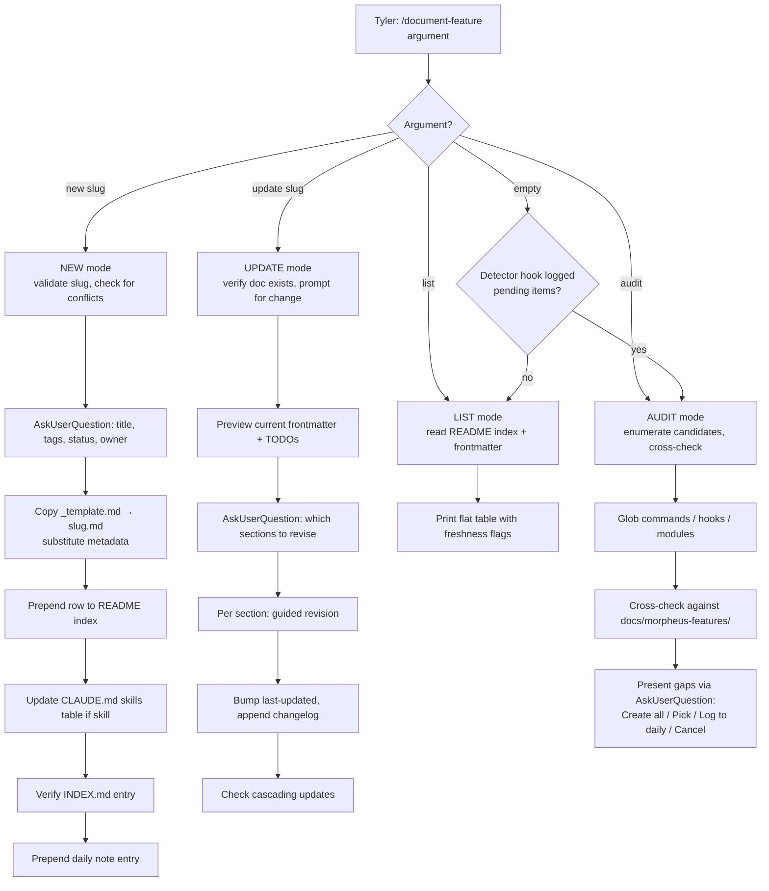

# Feature Documentation System

> **Closed loop that prevents documentation drift — `feature-change-detector.sh` surfaces doc debt to the daily note when Morpheus features/architecture change; `/document-feature` is how Tyler works through the backlog.**

## Overview

**What it is**: A two-component closed loop that prevents documentation drift. `feature-change-detector.sh` is the passive surface — a PostToolUse hook that watches `.claude/commands/**`, `.claude/hooks/**`, `scripts/**` for Edit/Write, derives a slug from the changed path, cross-checks against `docs/morpheus-features/`, and appends an idempotent todo to the daily note `## Tomorrow's Prep` if the feature has no doc. `/document-feature` is the active resolver — a slash command with 4 modes (new / update / list / audit) Tyler uses to work through surfaced debt. Strict separation: the hook only appends, never edits feature docs; the skill is the only thing that writes to `docs/morpheus-features/`.

**Why it exists**: Morpheus grows feature-by-feature, and undocumented features become support tickets the moment the system is forked to the Goodwin InfoSec team. Without this loop, new skills land without `docs/morpheus-features/` entries; hook changes land without doc updates; consolidation docs drift from absorbed skills. The loop makes doc debt visible at the moment it's incurred (detector) and gives Tyler a direct command to pay it down (`/document-feature`). The two-component split is the point: passive surfacing doesn't interrupt Tyler's flow, and active resolution happens on his schedule.

**Who uses it**: Tyler runs `/document-feature` in 4 modes — new (scaffolding), update (section revision), list (freshness audit), audit (bulk gap-find). The detector hook fires invisibly on every matching Edit/Write. Future Goodwin teammates forking Morpheus will inherit this loop — the expectation is that they run `/document-feature new <slug>` whenever they contribute a new skill, and the detector ensures they don't silently skip it.

**Status**: `active` — detector hook + `/document-feature` skill both shipped 2026-04-17 (initial build); self-referential fill complete 2026-04-21 (this doc documents the system that documents itself).

## Architecture

The feature documentation system is a two-component closed loop. `feature-change-detector.sh` is the passive surface — a PostToolUse hook that watches `.claude/commands/**`, `.claude/hooks/**`, and `scripts/**` for Edit or Write calls, derives a slug from the changed path, cross-checks against `docs/morpheus-features/`, and appends a todo to the daily note `## Tomorrow's Prep` section if the feature has no doc. `/document-feature` is the active resolver — a slash command with four modes (new, update, list, audit) that Tyler uses to work through the surfaced debt. The two components have strict separation: the hook only appends, never edits feature docs; the skill is the only thing that writes to `docs/morpheus-features/`.

### Detector hook flow (PostToolUse surfacing)

```mermaid
flowchart LR
  A[Edit or Write tool<br/>called anywhere] --> B[PostToolUse hook<br/>matcher: Edit\|Write]
  B --> C[feature-change-detector.sh<br/>fires with 5000ms timeout]
  C --> D{Changed path matches<br/>.claude/commands/** OR<br/>.claude/hooks/** OR<br/>scripts/** ?}
  D -->|no| E[Skip — not a feature change]
  D -->|yes| F[Skip if stock Claude Code<br/>init.md / review.md /<br/>security-review.md]
  F --> G[Derive slug from path<br/>e.g. .claude/commands/foo.md → foo]
  G --> H{Feature doc exists?<br/>docs/morpheus-features/slug.md}
  H -->|yes| I[Existing doc — flag for update<br/>append: /document-feature update slug]
  H -->|no| J[Missing doc — flag for new<br/>append: /document-feature new slug]
  I --> K[Append to today's daily note<br/>## Tomorrow's Prep<br/>unchecked checkbox, idempotent]
  J --> K
  K --> L[Done — hook exits]
  L --> M[Tyler sees todo tomorrow;<br/>runs /document-feature at discretion]
```

**What happens**: The hook is deliberately narrow — watches three path patterns (skills, hooks, scripts), skips three specific stock files (`init.md`, `review.md`, `security-review.md` are Claude Code built-ins, not Morpheus features), derives the slug, cross-checks `docs/morpheus-features/<slug>.md` existence, and either appends a todo item or does nothing. Idempotency matters: if the same feature is edited three times in a session, the todo item appears in `## Tomorrow's Prep` once, not three times (the hook checks for an existing line before appending). Critical path exclusion: the hook does NOT watch `docs/morpheus-features/**` itself, so editing a feature doc does NOT trigger recursive doc-debt surfacing. This scoping is essential — otherwise Phase 8 of this very task would have created an infinite feedback loop.

### /document-feature mode selection



**What happens**: Four explicit modes + an implicit default. Default (no arg) dispatches to audit if the detector has logged items, else list. Every mode uses `AskUserQuestion` for clarifications — the skill never asks via inline prose. Write scope is strictly limited: new mode writes a scaffold from `_template.md` but never the prose content (Tyler writes the prose later via update mode); update mode walks Tyler through section revisions and makes the edits he dictates; list is read-only; audit is read-only by default and proposes actions Tyler must approve. Rule 1 of the skill: never auto-write documentation content — scaffold + surface + ask, but Tyler writes the prose. The exception to Rule 1 is this very task (`2026-04-17-feature-docs-prose-fill`) which is an explicit prose-fill exercise — Tyler approved the scope-exception in the plan.

### Three-surface sync

```mermaid
flowchart LR
  subgraph Surfaces["Three surfaces that must stay in sync"]
    README[docs/morpheus-features/README.md<br/>index table<br/>row per feature<br/>status + ready marker]
    CLAUDE[CLAUDE.md<br/>## Skills table<br/>row per skill<br/>references feature doc]
    INDEX[INDEX.md<br/>directory source of truth<br/>entry per file]
  end

  NEW[/document-feature new slug] --> U1[Write docs/morpheus-features/slug.md]
  U1 --> U2[Prepend README row]
  U1 --> U3[Prepend CLAUDE.md skills row<br/>if feature is a skill]
  U1 --> U4[update-index.sh auto-adds<br/>to INDEX.md on Write]

  U2 --> README
  U3 --> CLAUDE
  U4 --> INDEX

  UPD[/document-feature update slug] --> V1[Edit docs/morpheus-features/slug.md]
  V1 --> V2{CLAUDE.md still<br/>accurate?}
  V2 -->|no| V3[Update skills row]
  V2 -->|yes| V4[Skip]
  V3 --> CLAUDE
  V1 --> INDEX

  LST[/document-feature list] --> W[Read-only:<br/>README index parse<br/>+ per-doc frontmatter]
  W --> README

  AUD[/document-feature audit] --> X[Cross-check:<br/>glob .claude/commands/ + hooks/ + scripts/<br/>vs README index]
  X --> README
```

**What happens**: Three surfaces — `docs/morpheus-features/README.md` (the features index table), `CLAUDE.md` (the top-level skills table Morpheus reads on every session), and `INDEX.md` (the directory-wide source of truth). When a feature doc is created or updated, all three must end up consistent: the README row reflects the frontmatter's status, CLAUDE.md references the feature doc if the feature is a skill, INDEX.md has an entry for the doc file. `update-index.sh` PostToolUse hook handles INDEX.md automatically on any Write. README and CLAUDE.md updates are explicit — new mode prepends both, update mode re-verifies CLAUDE.md after edits. The audit mode cross-checks all three: flags skills that have code but no feature doc, feature docs not referenced in CLAUDE.md, and README rows that don't match frontmatter status.

## User flows

### Flow 1: New feature created — detector surfaces, /document-feature new resolves

**Goal**: when a new skill or hook lands, get a doc-debt todo surfaced to tomorrow's prep; Tyler creates the feature doc scaffold at his convenience.

**Steps**:
1. Tyler (or Morpheus) writes `.claude/commands/new-skill.md` or `.claude/hooks/new-hook.sh`.
2. PostToolUse hook `feature-change-detector.sh` fires. Derives slug = `new-skill` (or `new-hook`). Cross-checks `docs/morpheus-features/new-skill.md` — doesn't exist.
3. Appends idempotent todo to today's daily note `## Tomorrow's Prep`: `- [ ] Doc review: new-skill changed in this session — run /document-feature new new-skill`.
4. Next day (or later), Tyler sees the todo in Tomorrow's Prep. Runs `/document-feature new new-skill`.
5. Skill validates slug, checks for conflicts, prompts via AskUserQuestion for title / tags / status / owner.
6. Copies `_template.md` → `docs/morpheus-features/new-skill.md` with metadata substitution. Section bodies kept as TODO placeholders for Tyler to fill later.
7. Prepends row to `docs/morpheus-features/README.md` index. If new-skill is a slash command, prepends row to CLAUDE.md skills table.
8. `update-index.sh` PostToolUse hook auto-adds to `INDEX.md`.
9. Prepends daily note timeline entry.

**Example**:
```bash
# Tyler writes new hook
Write .claude/hooks/kb-staleness-check.sh
# → feature-change-detector fires
# → Tomorrow's Prep gets: "- [ ] /document-feature new kb-staleness-check"
# Tyler, next morning:
/document-feature new kb-staleness-check
# → AskUserQuestion: title? tags? status?
# → docs/morpheus-features/kb-staleness-check.md scaffolded
# → README row 10 added
# → Tyler fills prose later via /document-feature update
```

**Expected result**: no undocumented features slip through; scaffold lands fast, prose fills later; three surfaces stay in sync.

### Flow 2: Existing feature changed — detector surfaces update todo

**Goal**: when an existing skill or hook is modified, surface a reminder so the feature doc doesn't go stale.

**Steps**:
1. Tyler edits `.claude/commands/research.md` (existing skill; has a feature doc at `docs/morpheus-features/research-and-investigation.md`).
2. PostToolUse hook fires. Derives slug = `research`. But wait — this skill is absorbed into `research-and-investigation` not its own doc. The hook checks first for exact slug match, then checks README index for `absorbs-skills: [research, ...]` metadata.
3. If absorbed: flag with consolidation note. If standalone: flag `/document-feature update research`.
4. Append to Tomorrow's Prep: `- [ ] Doc review: research changed — update docs/morpheus-features/research-and-investigation.md (absorbs)`.
5. Tyler runs `/document-feature update research-and-investigation`.
6. Skill previews current frontmatter + any remaining TODO markers. Prompts AskUserQuestion: which sections need revision?
7. Guided revision: per selected section, skill opens the relevant block, prompts Tyler for the revision, applies via Edit. Bumps `last-updated`. Appends changelog row.
8. Checks cascading updates: does CLAUDE.md still accurately reference this feature? Is a related runbook out-of-date? Surface via AskUserQuestion.
9. Daily note timeline entry.

**Example**:
```bash
Edit .claude/commands/research.md
# → Tomorrow's Prep: "- [ ] /document-feature update research-and-investigation (absorbs research)"
/document-feature update research-and-investigation
# → preview current frontmatter
# → AskUserQuestion: which sections? [User flows, Config]
# → Tyler dictates revisions per section
# → last-updated bumped, changelog row appended
```

**Expected result**: existing feature docs stay fresh as their source code evolves; stale docs never silently rot.

### Flow 3: /document-feature audit finds 25 gaps — consolidation pattern (this task's origin)

**Goal**: bulk-audit for feature-doc gaps; consolidate related skills into grouped docs rather than creating N small docs.

**Steps**:
1. Tyler runs `/document-feature audit`.
2. Skill globs `.claude/commands/`, `.claude/hooks/`, `scripts/` subdirs; filters stock Claude Code files; cross-checks against `docs/morpheus-features/` index.
3. Finds N candidates with no feature doc (in this task's case: 25 raw gaps).
4. AskUserQuestion with 4 options: Create all now / Pick which ones / Log all to daily note / Cancel. For 25 gaps, Tyler may prefer consolidation.
5. If Tyler chooses consolidation path, skill suggests groupings (e.g., daily-note-management + create-daily-notes + read-today + catch-up + jot-idea + checkpoint + eod + weekly-review → all absorbed into `daily-notes-system.md`).
6. For each consolidated doc, skill creates scaffold with `absorbs-skills: [list]` metadata tracking which original skills are absorbed.
7. Original skill files remain untouched; absorption is metadata-only.
8. README index + CLAUDE.md + INDEX.md updated for each new grouped doc.

**Example** (this task's actual run):
```bash
/document-feature audit
# → 25 doc gaps identified
# → AskUserQuestion: "Group into 7-8 consolidated docs (Recommended)"
# Tyler: yes
# → 8 skeletons created:
#   orchestration-loop (absorbs 3 skills)
#   hooks-framework (absorbs 12 hooks)
#   task-state-management (absorbs 3 skills)
#   daily-notes-system (absorbs 8 skills)
#   context-engineering (absorbs 2 skills)
#   research-and-investigation (absorbs 3 skills)
#   scripting-lifecycle (absorbs 2 skills)
#   feature-documentation-system (absorbs /document-feature + detector hook — self-referential)
# → 25 gaps → 8 cohesive docs; discoverability preserved via absorbs-skills metadata
```

**Expected result**: audit surfaces gaps; consolidation preserves discoverability without inflating doc count; `absorbs-*` metadata gives future audits the mapping to know which source files correspond to which feature doc.

## Configuration

| Path / Variable | Purpose | Default | Required? |
|-----------------|---------|---------|-----------|
| `docs/morpheus-features/` | Feature docs home directory | scaffolded by task `2026-04-17-morpheus-feature-docs` | yes |
| `docs/morpheus-features/_template.md` | Canonical template for new docs (8 sections, frontmatter fields, changelog format) | — | yes |
| `docs/morpheus-features/README.md` | Features index — row per feature, flipped ✅ when Tyler marks ready | — | yes |
| `.claude/commands/document-feature.md` | Skill with 4 modes (new / update / list / audit) | — | yes |
| `.claude/hooks/feature-change-detector.sh` | PostToolUse hook that surfaces doc debt | registered in `settings.local.json` | yes |
| `.claude/settings.local.json` PostToolUse entry | Detector hook registration | added by task `2026-04-17-morpheus-feature-docs` | yes |

### Detector hook watched paths

| Path pattern | Rationale |
|--------------|-----------|
| `.claude/commands/**` | Skills — any new or edited skill may need a feature doc |
| `.claude/hooks/**` | Hooks — new or edited hooks need doc updates |
| `scripts/**` | Script modules (PS modules, Python scripts, bash utilities) — large scripts merit feature docs |
| `docs/morpheus-features/**` | **NOT watched** — prevents recursive surfacing when feature docs themselves are edited |
| `init.md`, `review.md`, `security-review.md` | Stock Claude Code skills — skipped, not Morpheus features |
| Utility hooks (`prepend-reminder.sh`) | Scaffold infrastructure, not features — skipped |

### /document-feature mode argument reference

| Invocation | Behavior |
|------------|----------|
| `/document-feature new <slug>` | Scaffold new feature doc from `_template.md` |
| `/document-feature update <slug>` | Revise existing doc; guided section revision + cascading updates |
| `/document-feature list` | Print index with freshness flags |
| `/document-feature audit` | Deep scan: code-without-doc candidates; group or create via AskUserQuestion |
| `/document-feature` (no arg) | Default: audit if detector has pending items; else list |

## Integration points

| Touches | How | Files |
|---------|-----|-------|
| Daily note | Detector appends to `## Tomorrow's Prep` idempotently; skill modes prepend timeline entries | `.claude/rules/daily-note.md`, `notes/YYYY/MM/YYYY-MM-DD.md` |
| CLAUDE.md | `new` mode prepends row to skills table if feature is a slash command; `update` re-verifies reference accuracy | `CLAUDE.md` |
| INDEX.md | `new` mode verifies `update-index.sh` PostToolUse hook added the entry | `INDEX.md`, `.claude/hooks/update-index.sh` |
| Hooks framework | Detector is a first-class PostToolUse hook; subject to all hook-framework rules (timeout, PS vs jq, signed if .ps1) | `docs/morpheus-features/hooks-framework.md` |
| Orchestration loop | Consolidated docs use `absorbs-skills` metadata to preserve discoverability across audits | `docs/morpheus-features/orchestration-loop.md` |
| Task state management | `/document-feature audit` with >5 gaps may propose a grouped-consolidation task via `/project-init` | `docs/morpheus-features/task-state-management.md` |
| All other feature docs | Cross-link via `[related feature doc](other-doc.md)` entries in References; audit checks reciprocity | all 8 feature docs |

## Troubleshooting

| Symptom | Likely cause | Fix |
|---------|-------------|-----|
| Detector hook not firing when a skill or hook is edited | Hook timed out, crashed, or matcher misconfigured (observed during initial build) | Grep session output for `[HOOK:PostToolUse] FIRED — feature-change-detector`. If absent: check `settings.local.json` registration, confirm timeout is 5000ms, run `bash .claude/hooks/feature-change-detector.sh` manually to check stderr. See hooks-framework.md troubleshooting for full diagnosis sequence. |
| bash syntax error in detector near awk block | Apostrophe inside single-quoted awk expression — the "Tomorrow's Prep" comment gotcha (observed 2026-04-17) | Avoid apostrophes inside `awk '...'` even in comments. Rewrite the awk argument without the apostrophe (e.g., "Tomorrow Prep section"), or use double-quoted awk with escaped internal quotes. This specific bug hit during Phase 0 build of this very system. |
| Tomorrow's Prep has stale todos Tyler already resolved | Tyler completed the work but didn't check the box (theoretical) | Detector hook is idempotent on append but doesn't auto-clear. At `/eod` time, review Tomorrow's Prep manually and check/uncheck based on actual completion. Could add a `/eod` sub-step to auto-prune resolved todos in a future revision. |
| `docs/morpheus-features/` scaffold missing | Project forked without the directory (theoretical — shouldn't happen post-initial-build) | `/document-feature new <slug>` will error with: "docs/morpheus-features/ scaffold is incomplete — run /the-protocol 'rebuild morpheus-features scaffold' first". Tyler runs the protocol task to re-create from git history. |
| Detector fires recursively on feature doc edits | Watched path expanded to include `docs/morpheus-features/` by mistake | Edit `.claude/settings.local.json` — the detector's path check must explicitly exclude `docs/morpheus-features/**`. Recursive surfacing = infinite doc-debt loop. Verified safe in current version; would recur only if someone broadened the watch pattern. |
| `/document-feature new` silently writes prose content | Rule 1 violation — skill is supposed to scaffold + prompt, never hallucinate feature details | Audit the skill's implementation; the `_template.md` copy must preserve section-body placeholder markers (HTML comment TODOs) rather than filling them. Only frontmatter metadata should be filled by the skill. Prose is always Tyler's job. |
| Consolidation doc drifts from absorbed skills | The skill file changed but the consolidated feature doc wasn't updated | Detector should fire `/document-feature update <consolidation-slug>` when any absorbed skill changes. If it doesn't, check detector's logic for `absorbs-skills` metadata reading — it should read the README index to map original-skill-slug → consolidated-feature-doc-slug. |

## References

**Active surfaces**:
- [`.claude/commands/document-feature.md`](../../.claude/commands/document-feature.md) — the skill (4 modes)
- [`.claude/hooks/feature-change-detector.sh`](../../.claude/hooks/feature-change-detector.sh) — the passive detector

**Doc system structure**:
- [`docs/morpheus-features/README.md`](README.md) — features index
- [`docs/morpheus-features/_template.md`](_template.md) — canonical template
- [`docs/morpheus-features/o365-planner-integration.md`](o365-planner-integration.md) — reference-quality exemplar

**Build history**:
- [`hub/staging/2026-04-17-morpheus-feature-docs/STATE.md`](../../hub/staging/2026-04-17-morpheus-feature-docs/STATE.md) — initial scaffold build (8 skeleton docs)
- [`hub/staging/2026-04-17-feature-docs-prose-fill/STATE.md`](../../hub/staging/2026-04-17-feature-docs-prose-fill/STATE.md) — prose-fill execution for 8 skeletons (this task)

**Related feature docs**:
All eight feature docs cross-link here — full doc-system lattice complete after Phase 8.5 normalization:
- [`docs/morpheus-features/orchestration-loop.md`](orchestration-loop.md)
- [`docs/morpheus-features/hooks-framework.md`](hooks-framework.md) — detector is a first-class hook
- [`docs/morpheus-features/task-state-management.md`](task-state-management.md)
- [`docs/morpheus-features/daily-notes-system.md`](daily-notes-system.md) — Tomorrow's Prep surface
- [`docs/morpheus-features/context-engineering.md`](context-engineering.md)
- [`docs/morpheus-features/research-and-investigation.md`](research-and-investigation.md)
- [`docs/morpheus-features/scripting-lifecycle.md`](scripting-lifecycle.md)
- [`docs/morpheus-features/o365-planner-integration.md`](o365-planner-integration.md)

**Top-level**:
- [`CLAUDE.md`](../../CLAUDE.md) — skills table + Key Files referencing this directory
- [`INDEX.md`](../../INDEX.md) — directory source of truth (auto-indexed)

## Changelog

| Timestamp | Project | Agent | Change |
|-----------|---------|-------|--------|
| 2026-04-21 | 2026-04-17-feature-docs-prose-fill | morpheus | Filled skeleton to active (self-referential — docs the system that docs itself): 3 Mermaid (detector PostToolUse surfacing flow, /document-feature 4-mode selection + actions, three-surface sync README/CLAUDE/INDEX), Configuration expanded to 6 rows + detector watched-paths table + 4-mode argument reference, Integration points to 7 rows, 3 user flows (new feature scaffold, update existing with absorbs-skills awareness, audit + consolidation as this task's origin), 7-row troubleshooting including the apostrophe-in-awk bug from initial build + recursive-loop prevention via docs/** exclusion. |
| 2026-04-17T11:00 | 2026-04-17-morpheus-feature-docs | morpheus | Skeleton created via /document-feature audit consolidation — prose TODO (self-referential) |
