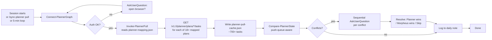
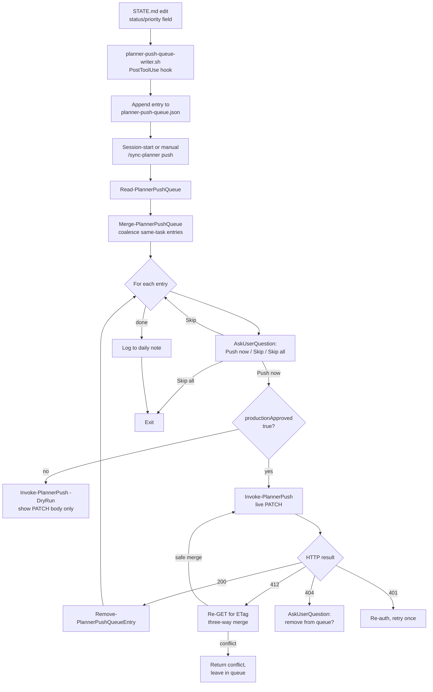
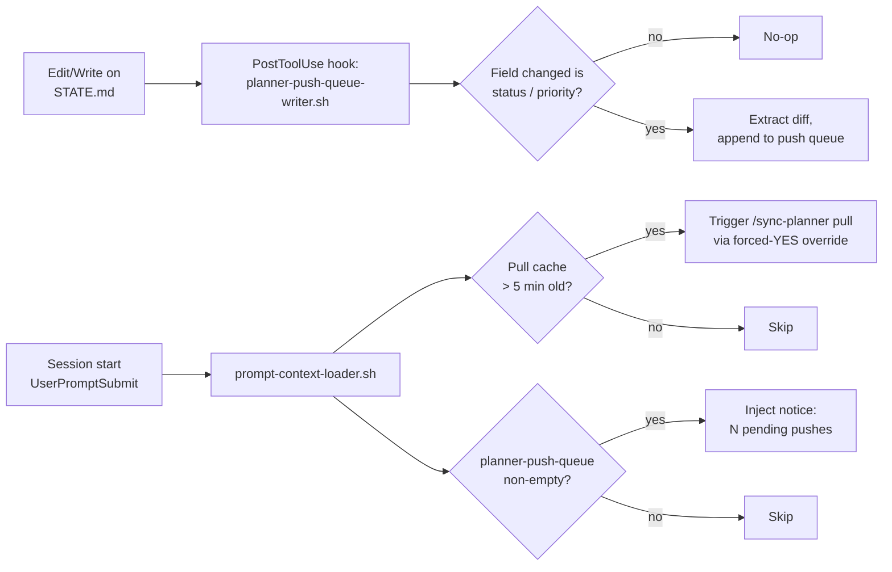

# O365 Planner Integration

> **Two-way sync between Microsoft Planner and Morpheus task state — pull tasks from 9+ Planner boards into local cache; push STATE.md changes back to Planner with human-in-the-loop approval.**

## Overview

**What it is**: A two-way synchronization layer between Tyler's local Morpheus task state (STATE.md files + hooks + skill) and Microsoft Planner boards (personal "{{user.name}}'s Work" + project boards in Information Security and Infosec Projects M365 groups). The sync runs in two directions:

- **Pull**: Planner → local cache (`hub/state/planner-pull-cache.json`), on session start, every 5 minutes, and on manual `/sync-planner pull`.
- **Push**: STATE.md change → push queue → `/sync-planner push` → approval gate → dual-write to personal + project board.

**Why it exists**: Tyler tracks his work in two places — Morpheus STATE.md files (rich, local, agent-readable) and Microsoft Planner (team-visible, stakeholder-expected, mobile-accessible). Keeping these in sync manually is error-prone. The integration makes the local STATE.md the source of truth for ongoing Morpheus work while ensuring Planner boards never go stale. The human-in-the-loop approval on every push prevents Morpheus from silently writing to team-visible production boards.

**Who uses it**: Tyler directly via `/sync-planner`. Morpheus also invokes pull automatically at session start when the cache is stale (>5 min old). Hooks invoke the push-queue writer whenever STATE.md status/priority fields change. No sub-agent ever writes to Planner without explicit Tyler approval.

**Status**: `active` (production-ready as of 2026-04-17 — first live push validated end-to-end).

## Architecture

The integration is composed of five machine layers that compose via file-based handoff:

1. **Skill layer** — `/sync-planner` slash command (`.claude/commands/sync-planner.md`) orchestrates user interaction, approval gates, and calls into the module.
2. **Module layer** — `scripts/planner/PlannerSync.psm1` (11 exported PowerShell functions) handles auth, routing, pull, push, conflict detection, and queue management.
3. **State layer** — five JSON files under `hub/state/` that act as durable handoff surfaces between session runs.
4. **Hook layer** — `planner-push-queue-writer.sh` detects STATE.md field changes and writes them to the push queue; `prompt-context-loader.sh` injects a "pending pushes" notice at session start.
5. **Graph API layer** — Microsoft Graph Planner endpoints (`/v1.0/planner/tasks/*`) via `Microsoft.Graph.Planner` PowerShell SDK using WAM browser auth (device code blocked by Goodwin CA policy 530033).

### Pull flow



**What happens**: Pull is always safe (read-only against Planner). The module fans out one GET per mapped plan, merges results into `planner-pull-cache.json`, and runs `Compare-PlannerState` to find divergences between the pull result and local task state. The reconciler is **push-queue-aware** — any field already in the pending push queue is skipped (otherwise a recent local change would get silently overwritten by a pull). Conflicts that remain are surfaced one-by-one via `AskUserQuestion` — never batched.

### Push flow



**What happens**: The push path is explicitly approval-gated at two points. (1) The `AskUserQuestion` prompt for every coalesced entry — Morpheus never auto-pushes even if the queue is non-empty. (2) The `productionApproved` flag in `planner-ids.json` — if absent or false, every push runs in `-DryRun` and prints the PATCH body without sending it. Tyler must set the flag explicitly to enable live writes. The 412 retry path (semantic three-way merge) handles ETag staleness: on first-ever push against a task, the local ETag is empty, Planner rejects with 412, the handler re-GETs, extracts the fresh ETag, and retries. This path also detects true conflicts (remote field changed to something neither side expected) and returns them for interactive resolution.

### Dual-write topology

```mermaid
flowchart LR
  subgraph Morpheus["Morpheus (local)"]
    A[STATE.md edit]
    B[planner-push-queue.json]
    C[planner-ids.json<br/>taskId -> plannerTaskId + ETag]
    D[planner-mapping.json<br/>routing slugs -> plans]
  end

  subgraph Graph["Microsoft Graph Planner"]
    P[Personal: {{user.name}}'s Work<br/>_9ydI8b6bEi6IRynKFXILWUAEx_5]
    Q1[Project: Vulnerability Mgmt]
    Q2[Project: Third Party Risk]
    Q3[Project: ... 16 more]
  end

  A --> B
  B --> |approval| C
  C -->|dual-write:<br/>personalPlannerTaskId| P
  C -->|dual-write:<br/>plannerTaskId via routing| Q1
  C -.->|if routed| Q2
  C -.->|if routed| Q3
```

**What happens**: Every push is a **dual-write** — the change lands on Tyler's personal plan AND the routed project plan (if routing matches). `Resolve-PlannerRoute` inspects the task-id or explicit routing slug against `planner-mapping.json` and returns both a `personal` plan target (always) and a `project` plan target (if any routing slug matches). If a project route can't be resolved, the push goes personal-only and Tyler is prompted. If the personal write succeeds but the project write fails, Morpheus does not roll back the personal write — the partial state is logged and the project write stays queued for retry.

### Hook chain



**What happens**: Two hooks wire the integration into Morpheus's normal flow. The **PostToolUse hook** fires on any `Edit`/`Write` tool call, inspects the target path, and if it's a STATE.md file, diffs the relevant fields and appends to the push queue. The **UserPromptSubmit hook** runs at session start and at every user prompt — it detects a stale pull cache (auto-pull) and a non-empty push queue (inject notice so Tyler knows to run `/sync-planner push` when ready). No hook ever writes to Planner — they only write to the local queue and notice surface.

## User flows

### Flow 1: Pull — see latest Planner state

**Goal**: refresh local pull cache so Morpheus knows current Planner task states.

**Steps**:
1. Tyler runs `/sync-planner pull` (or session-start hook triggers it automatically when cache >5 min old).
2. Morpheus calls `Connect-PlannerGraph` → WAM browser if not authenticated.
3. `Invoke-PlannerPull -All` fans out GETs across 18+ mapped plans.
4. Result lands in `hub/state/planner-pull-cache.json` (~700+ tasks).
5. `Compare-PlannerState` runs — conflicts surfaced via sequential `AskUserQuestion`.
6. Timeline entry prepended to today's daily note.

**Example**:
```bash
# Manual pull
/sync-planner pull
```

**Expected result**: `Pull complete — N tasks across M boards. K conflicts detected; X Planner-wins / Y Morpheus-wins / Z skipped.`

### Flow 2: Push — propagate STATE.md change to Planner

**Goal**: push a status/priority change from a STATE.md file back to the matching Planner task.

**Steps**:
1. Tyler edits `hub/staging/<task>/STATE.md` (changes `status: in-progress` for example).
2. PostToolUse hook `planner-push-queue-writer.sh` fires automatically → writes entry to `hub/state/planner-push-queue.json`.
3. `prompt-context-loader.sh` surfaces a "N pending pushes" notice on the next prompt.
4. Tyler runs `/sync-planner push` when ready.
5. `Merge-PlannerPushQueue` coalesces same-task entries into compound changes.
6. For each entry: `AskUserQuestion` — "Push now / Skip / Skip all remaining".
7. On "Push now": `Invoke-PlannerPush` executes (DryRun if `productionApproved: false`, live if `true`).
8. On success (possibly after 412 retry): entry removed from queue, ETag recorded in `planner-ids.json`.
9. Timeline entry prepended to daily note.

**Example**:
```bash
# Manual push
/sync-planner push
```

**Expected result**: For each queued entry, an `AskUserQuestion` prompt. After approval decisions: `Pushed N / Skipped M / Remaining K in queue`.

### Flow 3: First-time push bootstrap

**Goal**: push a change against a task that has never been pushed before (no ETag on file).

**Steps**:
1. Seed `hub/state/planner-ids.json` with a mapping for the new task — `personalPlannerTaskId` pulled from `planner-pull-cache.json`.
2. Set `productionApproved: true` in the same file when ready to push live.
3. Run `/sync-planner push` normally.
4. First PATCH returns HTTP 412 (no `If-Match` because local ETag is empty) — **this is expected**.
5. Retry handler re-GETs the task, extracts fresh ETag, retries — second attempt returns 200.
6. Result: `success=true, retries=1, conflicts=0`. Fresh ETag recorded to `planner-ids.json` for subsequent pushes.

See [`planner-sync-runbook.md`](../reference/planner-sync-runbook.md#first-time-push-planner-idsjson-bootstrap) for the exact seed format.

## Configuration

| Path / Variable | Purpose | Default | Required? |
|-----------------|---------|---------|-----------|
| `hub/state/planner-mapping.json` | Plan/group/bucket/routing config — 18 plans + personal board + routing slugs | generated by T1.3 board inventory | yes |
| `hub/state/planner-ids.json` | Task ID mapping + ETags; `productionApproved` flag | not present until first push | yes (for push) |
| `hub/state/planner-pull-cache.json` | Last pulled Planner state — ~700+ tasks | generated by Invoke-PlannerPull | yes (for push-queue-aware reconcile) |
| `hub/state/planner-push-queue.json` | Pending push entries awaiting approval | `{entries:[]}` | yes |
| `Microsoft.Graph.Planner` PS module | Graph SDK — v2.36.1 | install via `Install-Module` | yes |
| `Tasks.ReadWrite`, `Group.Read.All`, `User.Read` scopes | Required Graph scopes | granted interactively on first `Connect-MgGraph` | yes |
| `.claude/hooks/planner-push-queue-writer.sh` | PostToolUse hook wiring | registered in `.claude/settings.local.json` | yes |

### First-time setup

From a clean fork of Morpheus, to get Planner sync working:

1. **Install the PS module**:
   ```powershell
   Install-Module Microsoft.Graph.Planner -Scope CurrentUser
   ```
2. **Verify signing**: `PlannerSync.psm1` and `PlannerSync.psd1` must be signed Valid.
   ```bash
   pwsh -Command "(Get-AuthenticodeSignature scripts/planner/PlannerSync.psm1).Status"
   ```
   If not Valid, run `/sign-script scripts/planner/PlannerSync.psm1` and repeat for `.psd1`.
3. **First auth**: Run `/sync-planner pull` — a browser window will open for WAM login. Do NOT use `-UseDeviceCode` (blocked by Goodwin CA policy 530033).
4. **Build board inventory**: If `planner-mapping.json` doesn't exist or is empty, re-run the board inventory step (see STATE.md T1.3 in the build-history reference).
5. **Enable live pushes** (only when ready): Edit `hub/state/planner-ids.json` and set `"productionApproved": true`.

## Integration points

| Touches | How | Files |
|---------|-----|-------|
| CLAUDE.md | `/sync-planner` registered in skills table | `CLAUDE.md` |
| Daily note | Logs timeline entries on every pull and push | `.claude/rules/daily-note.md` |
| STATE.md | PostToolUse hook watches for field changes | `.claude/hooks/planner-push-queue-writer.sh` |
| prompt-context-loader | Auto-pull on stale cache + push-queue notice injection | `.claude/hooks/prompt-context-loader.sh` |
| INDEX.md | All state files + scripts auto-indexed | `INDEX.md` |
| /sign-script | Used to sign PlannerSync module on edits | `.claude/commands/sign-script.md` |

## Troubleshooting

**Dedicated runbook**: [`docs/reference/planner-sync-runbook.md`](../reference/planner-sync-runbook.md) — covers auth failures, 412 errors, first-time bootstrap, verification, architecture quick-reference.

### Common failure modes (quick reference; see runbook for full diagnostics)

| Symptom | Likely cause | Fix |
|---------|-------------|-----|
| Module won't import | Signature invalidated by edit | `/sign-script scripts/planner/PlannerSync.psm1` |
| `Connect-PlannerGraph` throws | Expired token or missing scopes | Re-run `/sync-planner pull`; browser re-auth |
| Push "succeeds" but Planner unchanged | `productionApproved` missing or false | Edit `planner-ids.json`, set `"productionApproved": true` |
| First live push returns 412 | No stored ETag yet — expected | Retry handler auto-succeeds on attempt 2 (`retries: 1`) |
| Conflict on every first push | Hashtable access bug (pre-2026-04-17) | Already fixed; update PlannerSync.psm1 to current Valid signed version |
| Pull returns 0 tasks | `planner-mapping.json` empty | Re-run board inventory step |

## References

**Source code**:
- [`scripts/planner/PlannerSync.psm1`](../../scripts/planner/PlannerSync.psm1) — 11 exported functions, ~770 lines
- [`scripts/planner/PlannerSync.psd1`](../../scripts/planner/PlannerSync.psd1) — module manifest
- [`.claude/commands/sync-planner.md`](../../.claude/commands/sync-planner.md) — slash command skill
- [`.claude/hooks/planner-push-queue-writer.sh`](../../.claude/hooks/planner-push-queue-writer.sh) — PostToolUse hook

**State files**:
- [`hub/state/planner-mapping.json`](../../hub/state/planner-mapping.json)
- [`hub/state/planner-ids.json`](../../hub/state/planner-ids.json)
- [`hub/state/planner-pull-cache.json`](../../hub/state/planner-pull-cache.json)
- [`hub/state/planner-push-queue.json`](../../hub/state/planner-push-queue.json)

**Related runbook + ADRs**:
- [`docs/reference/planner-sync-runbook.md`](../reference/planner-sync-runbook.md) — troubleshooting
- [`thoughts/second-opinions/2026-04-15-planner-sync-edge-cases.md`](../../thoughts/second-opinions/2026-04-15-planner-sync-edge-cases.md) — design cross-check (Codex)
- [`hub/staging/2026-04-16-planner-workbench/`](../../hub/staging/2026-04-16-planner-workbench/) — future editable dashboard design

**Build history**:
- [`hub/staging/2026-04-15-planner-integration/STATE.md`](../../hub/staging/2026-04-15-planner-integration/STATE.md) — 5-wave build, 38 tasks, 53 Pester tests

**Upstream API**:
- Microsoft Graph Planner API: `https://learn.microsoft.com/en-us/graph/api/resources/planner-overview` (accessed 2026-04-15)
- Goodwin CA policy 530033: blocks `-UseDeviceCode` — WAM browser auth only

## Changelog

| Timestamp | Project | Agent | Change |
|-----------|---------|-------|--------|
| 2026-04-17T10:38 | 2026-04-17-morpheus-feature-docs | morpheus | Created first-class feature doc with Mermaid diagrams: pull flow, push flow, dual-write topology, hook chain. Incorporated 2026-04-17 hashtable bug fix and first-time bootstrap guidance. |
