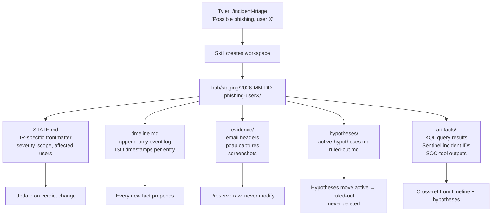

# Research & Investigation

> **Structured research artifacts, incident response triage workspaces, and independent Codex-based cross-checks — how Morpheus produces rigorous investigative output.**

## Overview

**What it is**: Three sibling skills that share a pattern — produce an investigative artifact with structured sections, explicit sources, numbered claims, acknowledged gaps, and a changelog. **`/research`** is for topical deep-dives (KQL best practices, threat actor TTPs, tool comparisons) and produces a 6-section artifact. **`/incident-triage`** creates a full IR workspace directory with STATE.md, timeline.md, evidence/, hypotheses/, and artifacts/ subdirs. **`/second-opinion`** invokes the Codex CLI with a multi-agent prompt to get an independent cross-check on a plan or decision; Claude's position is drafted first and never shared with Codex to preserve independence.

**Why it exists**: Security work is investigation-heavy, and unstructured notes don't scale or survive review. A research output without explicit sources can't be fact-checked; an IR scratchpad without an evidence/ subdir doesn't survive audit; a plan reviewed only by the same agent that wrote it tends toward confirmation bias. The three skills enforce discipline at the three failure modes: research needs sources + claims + gaps; IR needs workspace structure + immutable evidence + hypothesis tracking; decisions need independent cross-check. Once artifacts are structurally consistent, Tyler or a teammate can scan a research doc in 30 seconds to check its confidence shape, reopen an IR case weeks later and understand the state, or compare two AI perspectives side-by-side without re-running either.

**Who uses it**: Tyler directly for security research and IR casework. The orchestration loop's gatherer wave produces research artifacts matching the `/research` structure at `hub/staging/{task-id}/wave-N/round-N/research-{topic}.md`. `/second-opinion` is Tyler's decision-gate before committing to large plans or architectural choices — Codex has already caught several substantive issues in this very task's plan (Gate 2 violation, AC7 inconsistency, wrong self-reference risk row).

**Status**: `active` — `/research` production since 2026-03-30; `/incident-triage` added 2026-04-10; `/second-opinion` Codex integration added 2026-04-15.

## Architecture

Three sibling skills share a common pattern: produce an investigative artifact with structured sections, explicit sources, numbered claims, acknowledged gaps, and a changelog. `/research` is for topical deep-dives (KQL best practices, threat actor TTPs, tool comparisons). `/incident-triage` spins up a full workspace directory for IR cases (evidence, hypotheses, timeline, dedicated STATE.md). `/second-opinion` invokes the Codex CLI with a multi-agent prompt to get an independent cross-check on a plan or decision.

### /research artifact shape

```mermaid
flowchart TD
  A[Tyler: /research topic] --> B[Skill creates<br/>hub/staging/research-topic/research-topic.md]
  B --> C[Section 1: Intent<br/>why this research + success criteria]
  C --> D[Section 2: Sources<br/>numbered list: URL, access date,<br/>key takeaway per source]
  D --> E[Section 3: Findings<br/>organized by sub-topic<br/>claims cite source numbers]
  E --> F[Section 4: Claims matrix<br/>assertion \| supporting sources \| confidence]
  F --> G[Section 5: Gaps<br/>what's unresolved<br/>what would need more research]
  G --> H[Section 6: Changelog<br/>max 10 entries, newest first]
  H --> I[Orchestration: gatherer<br/>wave produces this as<br/>wave-N/round-N/research-topic.md]
```

**What happens**: `/research` enforces a 6-section structure so every research output is reviewable against the same skeleton. Sources are numbered, findings cite source numbers by reference, claims go into a matrix with confidence levels. Gaps are explicit — the artifact says what it doesn't know, not just what it does. When the orchestration loop dispatches a gatherer for a research wave, the gatherer produces this same structure at `hub/staging/{task-id}/wave-N/round-N/research-{topic}.md`. Consistent structure means Tyler can scan any research artifact in 30 seconds to check its confidence shape.

### /incident-triage workspace layout



**What happens**: IR workspaces mirror the SANS PICERL lifecycle (Preparation → Identification → Containment → Eradication → Recovery → Lessons) in directory form. `STATE.md` captures the IR-specific state — severity, scope, affected users, current phase. `timeline.md` is the chronological spine — every new fact (alert raised, user confirmed phishing, endpoint isolated) gets prepended with an ISO timestamp. `evidence/` preserves raw artifacts immutably (never modify raw email headers, pcap files, screenshots). `hypotheses/` tracks the thinking explicitly — active theories with supporting/refuting evidence, and a ruled-out file where abandoned theories live with the reason. `artifacts/` holds derived outputs like KQL results and SOC-tool dumps.

### /second-opinion flow (Codex CLI)

```mermaid
flowchart LR
  A[Tyler runs<br/>/second-opinion topic --files=path1,path2] --> B[Step 1: Claude drafts internal position<br/>3-5 bullets, NOT shared with Codex]
  B --> C[Step 2: Build context package<br/>read specified files, truncate to ~10K chars each]
  C --> D[Step 3: Write prompt to<br/>$TEMP/second-opinion-prompt.md<br/>with 4-agent scaffolding<br/>devil's-advocate, domain-expert, pragmatist, synthesis]
  D --> E[Step 4: Execute Codex CLI<br/>pwsh: Get-Content ... | codex exec --skip-git-repo-check -s read-only]
  E --> F{Codex returns?}
  F -->|ok| G[Step 5: Read response<br/>$TEMP/codex-response.md]
  F -->|error| H[Report error to Tyler<br/>present Claude position alone]
  G --> I[Step 6: Write comparison doc<br/>thoughts/second-opinions/YYYY-MM-DD-slug.md<br/>Claude position + Codex analysis + synthesis]
  I --> J[Step 7: Prepend daily note entry]
  J --> K[Step 8: Present concise summary + link]
```

**What happens**: `/second-opinion` is explicitly designed for disagreement — Claude's internal position is drafted BEFORE consulting Codex and is never shared with Codex, so both perspectives are independent. The prompt includes a multi-agent scaffolding (devil's advocate, domain expert, pragmatist, synthesis) that pushes Codex toward diverse analysis rather than sycophancy. The output is a structured comparison doc under `thoughts/second-opinions/`, formatted for side-by-side review. Environmental requirements: `codex` CLI installed + `OPENAI_API_KEY` env var + an `analyst` profile in `~/.codex/config.toml` (optional — falls back to defaults if missing). On Windows, the pwsh invocation must be single-quoted to prevent bash from mangling `$env:TEMP`; stdin redirect (`<`) is a PowerShell reserved operator so use `Get-Content ... | codex`.

## User flows

### Flow 1: /research — topical deep-dive with structured output

**Goal**: produce a 6-section research artifact Tyler (or a teammate) can scan in 30 seconds to check confidence shape.

**Steps**:
1. Tyler runs `/research "KQL best practices for DLP detection"`.
2. Skill creates `hub/staging/research-kql-dlp-best-practices/research-kql-dlp-best-practices.md`.
3. Intent section filled from Tyler's prompt + any clarifying AskUserQuestion (scope, depth, target audience).
4. Sources section is built iteratively via WebSearch / WebFetch / knowledge-base reads; each source numbered with URL, access date, key takeaway.
5. Findings organized by sub-topic; every claim cites source numbers by reference.
6. Claims matrix built: assertion / supporting sources / confidence level (High / Medium / Low / Speculative).
7. Gaps section explicit about what was not covered or remains unresolved.
8. Changelog entry added; artifact indexed via update-index.sh; daily note timeline entry prepended.

**Example**:
```bash
/research "KQL best practices for DLP detection"
# → 12 sources gathered (Microsoft docs, Sentinel blog, SANS whitepaper, GitHub detections)
# → Findings organized: query structure, false-positive reduction, entity mapping, performance
# → Claims matrix: 23 assertions, 14 High-confidence, 6 Medium, 3 Low
# → Gaps: no coverage of Gov cloud variants; custom log sources under-tested
# → Artifact: hub/staging/research-kql-dlp-best-practices/research-kql-dlp-best-practices.md
```

**Expected result**: structured artifact Tyler can review; confidence shape visible at a glance; gaps explicitly acknowledged so future research can fill them.

### Flow 2: /incident-triage — spin up an IR workspace

**Goal**: when a possible incident is in play, create a full workspace with the structure that survives audit.

**Steps**:
1. Tyler runs `/incident-triage "Possible phishing, user X clicked link from external sender"`.
2. Skill prompts via AskUserQuestion for severity (Low / Medium / High / Critical), affected-users count, initial phase (Identification per PICERL).
3. Creates `hub/staging/2026-MM-DD-phishing-userX/` with STATE.md (IR-specific frontmatter: severity, scope, phase), timeline.md (first event: "alert raised HH:MM"), evidence/ (empty, permissioned), hypotheses/active-hypotheses.md (seeded with "phishing confirmed" + "false positive" as two initial hypotheses), artifacts/ (empty).
4. Skill fires AskUserQuestion on initial containment decisions if severity is High+ (e.g., "isolate endpoint now / defer / leave running").
5. Any containment action gets logged to timeline.md with ISO timestamp and outcome.
6. Daily note timeline entry prepended: "IR workspace created: {incident-id}, severity={level}".

**Example**:
```bash
/incident-triage "user X clicked phishing link"
# severity=Medium, affected=1, phase=Identification
# → hub/staging/2026-04-21-phishing-userX/ created with 5 subdirs
# → timeline.md: "11:50:00Z — Alert raised (Defender P2), user X endpoint IP X.X.X.X"
# → active-hypotheses.md: 2 theories seeded
# → Tyler continues investigation, each new fact prepends to timeline.md
```

**Expected result**: IR case has audit-grade structure from minute one; evidence preserved immutably; hypotheses tracked explicitly; timeline is the chronological spine.

### Flow 3: /second-opinion — independent Codex cross-check

**Goal**: before committing to a plan or decision, get an independent review from Codex with no bias from Claude's internal reasoning.

**Steps**:
1. Tyler runs `/second-opinion "is this plan complete?" --files=C:\path\to\plan.md`.
2. Claude drafts internal position (3-5 bullets) — stored internally, NOT shared with Codex.
3. Skill reads referenced files, truncates to ~10K chars each, builds context package.
4. Writes prompt to `$TEMP/second-opinion-prompt.md` with 4-agent scaffolding (devil's advocate, domain expert, pragmatist, synthesis).
5. Invokes Codex: `Get-Content $TEMP/second-opinion-prompt.md | codex exec --skip-git-repo-check -s read-only -o $TEMP/codex-response.md -` (pwsh, single-quoted to preserve `$env:TEMP`).
6. Reads Codex response; writes comparison doc to `thoughts/second-opinions/YYYY-MM-DD-{slug}.md` with Claude position + Codex analysis + synthesis.
7. Prepends daily note entry.
8. Presents concise summary to Tyler + link to full comparison.

**Example**:
```bash
/second-opinion "is this plan complete?" --files={{paths.home}}\.claude\plans\crispy-popping-giraffe.md
# Claude position (internal): 5 bullets
# Codex returns: HIGH confidence, 9 findings including Gate 2 violation + AC7 inconsistency
# Comparison doc written: thoughts/second-opinions/2026-04-17-feature-docs-prose-fill-plan.md
# Result: plan revised before ExitPlanMode
```

**Expected result**: independent review available before commitment; disagreements surfaced explicitly; comparison doc preserves both perspectives for future reference.

## Configuration

| Path / Variable | Purpose | Default | Required? |
|-----------------|---------|---------|-----------|
| `hub/staging/{task-id}/research-*.md` | Research artifacts produced by `/research` or gatherer agent | per task | yes |
| `hub/staging/{task-id}/wave-N/round-N/research-{topic}.md` | Orchestrated research waves (same shape as /research) | per wave | yes |
| `hub/staging/{incident-id}/` | IR workspace created by `/incident-triage` | per incident | yes |
| `hub/staging/{incident-id}/timeline.md` | Chronological event log for IR | — | yes |
| `hub/staging/{incident-id}/evidence/` | Immutable raw artifacts | — | yes |
| `hub/staging/{incident-id}/hypotheses/` | Active + ruled-out theories | — | yes |
| `thoughts/second-opinions/YYYY-MM-DD-{slug}.md` | Codex cross-check comparison docs | — | optional |
| `OPENAI_API_KEY` env var | Codex CLI authentication | — | required for /second-opinion |
| `codex` CLI | Second-opinion engine (`codex --version` verifies) | install separately | required for /second-opinion |
| `~/.codex/config.toml` `[profiles.analyst]` section | Optional Codex profile with high reasoning + read-only sandbox | optional | recommended for /second-opinion |

### /research artifact structure (enforced 6 sections)

| Section | Purpose |
|---------|---------|
| 1. Intent | Why this research exists + what success looks like |
| 2. Sources | Numbered list with URL, access date, one-line takeaway |
| 3. Findings | Organized by sub-topic; claims cite source numbers |
| 4. Claims matrix | Assertion / supporting sources / confidence level |
| 5. Gaps | What's unresolved; what would need more research |
| 6. Changelog | Max 10 entries, newest first |

### /incident-triage workspace structure

| Path | Purpose |
|------|---------|
| `STATE.md` | IR-specific task state — severity, scope, affected users, current phase |
| `timeline.md` | Prepend-only chronological log; ISO timestamps |
| `evidence/` | Raw immutable artifacts (email headers, pcap, screenshots) |
| `hypotheses/active-hypotheses.md` | Theories still in play with supporting/refuting evidence |
| `hypotheses/ruled-out.md` | Abandoned theories with reason |
| `artifacts/` | Derived outputs (KQL results, Sentinel IDs, tool dumps) |

## Integration points

| Touches | How | Files |
|---------|-----|-------|
| Orchestration loop | Gatherer wave produces research artifacts per the 6-section structure; planner consumes | `.claude/agents/gatherer.md`, `docs/morpheus-features/orchestration-loop.md` |
| STATE.md | Research artifacts listed in Context Inventory; IR STATE.md is a specialized schema | `docs/morpheus-features/task-state-management.md` |
| Daily note | `/research`, `/incident-triage`, `/second-opinion` all prepend timeline entries | `.claude/rules/daily-note.md` |
| INDEX.md | All produced artifacts auto-indexed via `update-index.sh` PostToolUse hook | `INDEX.md`, `.claude/hooks/update-index.sh` |
| /approve-pending | High-risk IR actions (isolate endpoint, revoke session) route through approvals | `docs/morpheus-features/task-state-management.md` |
| Planner sync | IR engagements may get a Planner task via `/sync-planner` for team visibility | `docs/morpheus-features/o365-planner-integration.md` |
| Knowledge base | Completed research migrates to `knowledge/` with cross-ref metadata on `/eod` | `.claude/rules/knowledge.md` |

## Troubleshooting

| Symptom | Likely cause | Fix |
|---------|-------------|-----|
| `/second-opinion` fails "codex: command not found" | Codex CLI not installed | Install per Codex project docs: `npm install -g @openai/codex` (or OS-specific). Verify with `codex --version`. See [`docs/SECOND-OPINION-SETUP.md`](../SECOND-OPINION-SETUP.md) for Goodwin-specific setup. |
| Codex returns auth error | `OPENAI_API_KEY` unset or invalid | Set `OPENAI_API_KEY` in environment: `[Environment]::SetEnvironmentVariable('OPENAI_API_KEY', 'sk-...', 'User')` in pwsh. Test with `codex --version` in a fresh shell. Don't commit the key. |
| Codex exits with "profile `analyst` not found" | `~/.codex/config.toml` missing the analyst profile | Either (a) create the profile per `docs/SECOND-OPINION-SETUP.md`, or (b) drop the `-p analyst` flag from the invocation — defaults are acceptable (multi-agent scaffolding lives in the prompt, not the profile). |
| Codex rate-limits on long context packages | Context > model window or >rate-limit tokens-per-minute | Truncate referenced files harder (current default ~10K chars each — drop to 5K). Split into two /second-opinion calls for separate files. Retry after 60s for rate-limit. |
| Evidence file shows as binary / garbled | UTF-16 encoding with BOM (Windows Notepad default) | Convert to UTF-8: `pwsh -c "Get-Content file.txt | Set-Content -Encoding UTF8 file.txt"`. For `.msg` exports from Outlook — these are OLE2 binary and unsupported by `/ingest-context` parser; re-export as `.eml` or plain text. |
| Research artifact missing sources section | `/research` skipped WebSearch because offline | Skill requires online WebSearch for external sources. Offline research is still possible from knowledge/ — skill should run with `--offline` flag (if implemented) or Tyler manually populates sources from local files. Claims with no source are marked `Speculative` confidence. |
| Incident-triage timeline.md shows entries out of order | Timeline prepended without checking timestamp | Timeline is append-order, not timestamp-order — Morpheus must check existing timestamps before inserting. For correction: manually reorder; add a `## Timeline Integrity Notes` comment if pattern recurs. |
| Two second-opinion runs give contradictory recommendations | Expected behavior when the decision is genuinely uncertain | Run a third with explicit "tie-breaker" framing, or escalate to Tyler's judgment. Not a bug — Codex reflects real ambiguity in the decision. Document both perspectives in the comparison doc. |

## References

**Skills**:
- [`.claude/commands/research.md`](../../.claude/commands/research.md) — topical deep-dive with structured output
- [`.claude/commands/incident-triage.md`](../../.claude/commands/incident-triage.md) — IR workspace creation
- [`.claude/commands/second-opinion.md`](../../.claude/commands/second-opinion.md) — Codex CLI independent cross-check

**Setup + external docs**:
- [`docs/SECOND-OPINION-SETUP.md`](../SECOND-OPINION-SETUP.md) — Codex CLI install + analyst profile
- [`hub/templates/state.md`](../../hub/templates/state.md) — base STATE.md template (IR extends this)

**Agents**:
- [`.claude/agents/gatherer.md`](../../.claude/agents/gatherer.md) — research wave executor, produces /research-shape artifacts

**Related feature docs**:
- [`docs/morpheus-features/orchestration-loop.md`](orchestration-loop.md) — gatherer wave + research artifacts in Context Inventory
- [`docs/morpheus-features/task-state-management.md`](task-state-management.md) — STATE.md schema extended for IR workspaces
- [`docs/morpheus-features/context-engineering.md`](context-engineering.md) — classification of research outputs into taxonomy

**External**:
- SANS PICERL IR framework (Preparation / Identification / Containment / Eradication / Recovery / Lessons)
- OpenAI Codex CLI project documentation

## Changelog

| Timestamp | Project | Agent | Change |
|-----------|---------|-------|--------|
| 2026-04-21 | 2026-04-17-feature-docs-prose-fill | morpheus | Filled skeleton to active: 3 Mermaid (/research 6-section artifact shape, /incident-triage workspace layout, /second-opinion flow with 8-step pwsh integration), Configuration expanded to 10 rows + artifact structure table + IR workspace table, Integration points to 7 rows, 3 user flows (/research KQL DLP example, /incident-triage phishing workspace, /second-opinion Codex cross-check using this task's plan as live example) with Goal/Steps/Example/Expected, 8-row troubleshooting covering Codex install/auth/profile/rate-limit + UTF-16 encoding + sources-missing + timeline-ordering + contradictory-recommendations, References split into 5 named subsections. |
| 2026-04-17T11:00 | 2026-04-17-morpheus-feature-docs | morpheus | Skeleton created via /document-feature audit consolidation — prose TODO |
