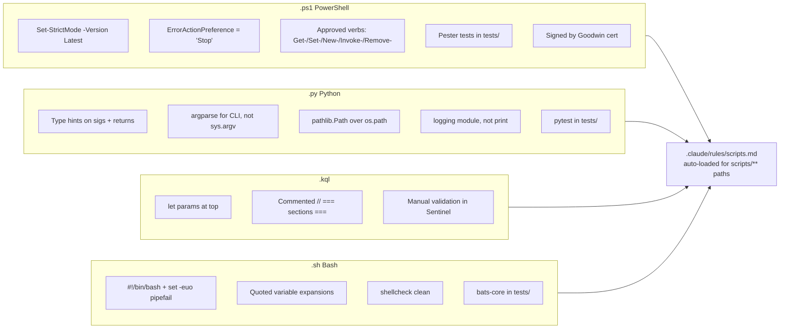

# Scripting Lifecycle

> **Scaffold → Sign → Test → Deploy pattern for PowerShell / Python / KQL / Bash scripts on Goodwin endpoints (AllSigned + ThreatLocker).**

## Overview

**What it is**: An opinionated 4-stage lifecycle — **Scaffold → Sign → Test → Deploy** — for scripts on Goodwin endpoints. `/script-scaffold` produces a new script with proper header, strict mode, language conventions per `.claude/rules/scripts.md`, and TDD shape (tests scaffolded before logic). `/sign-script` signs `.ps1` files with the Goodwin code signing certificate using a ThreatLocker-safe TEMP workaround. The hard invariant: **resolve trust BEFORE testing**. AllSigned execution policy refuses to run unsigned `.ps1` with confusing HashMismatch errors instead of real test failures — signing must happen first. Any subsequent edit invalidates the signature, which means the lifecycle loops: edit → re-sign → re-test → re-deploy.

**Why it exists**: Goodwin endpoints enforce two runtime trust gates (AllSigned + ThreatLocker) that first-time authors don't know about. Without the lifecycle, a new author writes a `.ps1`, tries to run it, hits a HashMismatch error, wastes an hour debugging the wrong layer (thinking the script logic is broken when actually it's unsigned), then tries to sign directly in the project tree, gets ThreatLocker-blocked, gives up. The lifecycle encodes: sign before test (not after), use `/sign-script` TEMP workaround (not direct `Set-AuthenticodeSignature`), re-sign on every edit (not just once at the end). Teammates forking Morpheus on Goodwin endpoints inherit this knowledge rather than rediscovering it.

**Who uses it**: Tyler when writing any new automation. Future Goodwin teammates forking Morpheus will use the lifecycle every time they touch a `.ps1`. Morpheus itself when editing existing hooks or modules — re-signing on every touch is automated via `/sign-script` called by the orchestration loop.

**Status**: `active` — lifecycle stabilized 2026-04-17 after HashMismatch diagnostic work on PlannerSync.psm1; `/sign-script` TEMP workaround production since 2026-04-15.

## Architecture

Scripts on Goodwin endpoints must satisfy two trust gates before they can run: AllSigned PowerShell execution policy (requires a valid signature from a trusted publisher for every `.ps1`) and ThreatLocker application control (allows signed scripts from approved publishers; blocks unknown binaries in non-standard paths). The lifecycle therefore has a hard invariant: **resolve trust BEFORE testing**. The `/script-scaffold` skill produces a new script with proper headers and TDD shape; `/sign-script` signs the `.ps1` with the Goodwin code signing certificate using a ThreatLocker-safe TEMP workaround.

### Build → Sign → Test → Deploy

```mermaid
flowchart LR
  A[Build<br/>/script-scaffold language slug] --> B[Header block<br/>Task / Agent / Plan / Purpose / Changelog]
  B --> C[Strict mode / argparse / set -euo<br/>per language]
  C --> D[Tests scaffolded first<br/>Pester / pytest / bats-core<br/>test_map.txt entry]
  D --> E[Write logic<br/>against tests]

  E --> F{Language?}
  F -->|.ps1| G[Sign<br/>/sign-script path.ps1]
  F -->|.py / .sh / .kql| H[Skip signing]

  G --> I[ThreatLocker check<br/>Goodwin cert auto-approved]
  H --> I

  I --> J[Test<br/>Pester / pytest / bats-core / manual KQL]
  J --> K{Pass?}
  K -->|no| L[Fix — increment Changelog]
  L --> E
  K -->|yes| M[Deploy<br/>move to target path<br/>register in settings.local.json if hook]

  M --> N[Any edit invalidates signature]
  N --> O[Re-sign → re-test → re-deploy]
```



**What happens**: Every script goes through all four stages, but the signing stage only applies to `.ps1` on Goodwin endpoints — Python, KQL, and bash don't need signatures because AllSigned only governs PowerShell. The invariant is that signing (trust resolution) must happen before testing, because AllSigned refuses to execute an unsigned `.ps1` — testing an unsigned module would fail with a confusing error instead of a real test failure. Any subsequent edit invalidates the signature (HashMismatch), which means the lifecycle loops: edit → re-sign → re-test → re-deploy. The scaffold stage uses language-specific conventions enforced by `.claude/rules/scripts.md`: header block with changelog, strict mode (PS: `Set-StrictMode -Version Latest; $ErrorActionPreference='Stop'`; Bash: `set -euo pipefail`; Python: type hints), test framework per language, `test_map.txt` mapping source functions to test functions.

### /sign-script ThreatLocker TEMP workaround

```mermaid
flowchart TD
  A[/sign-script scripts/path/file.ps1] --> B[bash cp file.ps1 to<br/>$env:TEMP/sign-work/]
  B --> C{Why TEMP?}
  C --> C1[ThreatLocker allows pwsh<br/>operations in TEMP]
  C --> C2[Blocks cert ops in<br/>non-standard project paths]

  B --> D[pwsh -Command<br/>Set-AuthenticodeSignature<br/>-Certificate $cert<br/>-FilePath TEMP/file.ps1]
  D --> E[Signature written<br/>in TEMP copy]
  E --> F[bash cp TEMP/file.ps1<br/>back to scripts/path/file.ps1]
  F --> G[Verify<br/>Get-AuthenticodeSignature<br/>.Status == Valid]
  G --> H{Valid?}
  H -->|no| I[Investigate — wrong cert,<br/>expired, HashMismatch after cp]
  H -->|yes| J[ThreatLocker auto-approves<br/>Goodwin-signed scripts<br/>per {{team.manager.name}}]
  J --> K[Ready to test / deploy]
```

**What happens**: The naive approach — running `Set-AuthenticodeSignature` directly against a script in the project tree — gets blocked by ThreatLocker because the project path isn't on ThreatLocker's allowlist for cert operations. The TEMP workaround moves the file through `$env:TEMP` (which ThreatLocker allows for pwsh operations), signs there, and copies back. First-time signing from Claude's Git Bash subprocess requires Tyler to approve a pending ThreatLocker tray request once; after that, Claude can sign autonomously. Always prefix `powershell.exe` with `PSModulePath` scoped to Windows PowerShell 5.1 paths — otherwise the cert store module may not be found.

### Language conventions



**What happens**: Per-language conventions are enforced by `.claude/rules/scripts.md`, auto-loaded whenever a script path is read or edited. PowerShell convention additionally covers approved verbs (run `Get-Verb` for the list), `[CmdletBinding()]` + `param()` for parameterized scripts, `-WhatIf` / `-Confirm` for destructive operations. Python uses argparse (never `sys.argv` parsing), type hints everywhere, pathlib over os.path, the logging module over print statements. KQL gets commented section headers (Parameters / Data Source / Filters / Output) and parameterized time ranges via `let` at the top. Bash uses strict mode, quoted variable expansions, `[[ ]]` over `[ ]`, and shellcheck must be clean.

## User flows

### Flow 1: /script-scaffold new PowerShell module with Pester

**Goal**: produce a new `.ps1` (or `.psm1`) with header, strict mode, parameter block, and a matching Pester test file — all conforming to `.claude/rules/scripts.md`.

**Steps**:
1. Tyler runs `/script-scaffold powershell scripts/path/my-auditor.ps1`.
2. Skill reads `.claude/rules/scripts.md` for PowerShell convention requirements.
3. Prompts via AskUserQuestion for purpose (one-line), parameters (if any), and whether it's a standalone script or a module function.
4. Writes the script with:
   - Header block: Task / Agent / Created / Plan / Purpose / Dependencies / Changelog (max 10)
   - `Set-StrictMode -Version Latest; $ErrorActionPreference='Stop'`
   - `[CmdletBinding()]` + `param()` if parameterized
   - `-WhatIf` / `-Confirm` support if destructive
   - `Write-Verbose` for diagnostics (not `Write-Host`)
5. Writes matching Pester test at `scripts/path/tests/my-auditor.Tests.ps1` with at least one `Describe` block seeded.
6. Appends to `scripts/path/tests/test_map.txt`: `scripts/path/my-auditor.ps1:Main -> tests/my-auditor.Tests.ps1:ItRuns`.
7. Prepends daily note timeline entry.

**Example**:
```bash
/script-scaffold powershell scripts/audit/check-sentinel-health.ps1
# → header + Set-StrictMode + param([string]$WorkspaceId)
# → tests/check-sentinel-health.Tests.ps1 with Describe block
# → test_map.txt updated
```

**Expected result**: runnable scaffold with tests that fail (red); Tyler fills in logic to make them green; every function-to-test pairing recorded in test_map.txt.

### Flow 2: /sign-script existing .ps1 with Goodwin cert

**Goal**: sign a `.ps1` that's been edited (either by Tyler or by Claude) so it can execute under AllSigned policy.

**Steps**:
1. Tyler (or Morpheus) runs `/sign-script scripts/path/my-auditor.ps1`.
2. Skill verifies Goodwin cert present in `Cert:\CurrentUser\My` (subject match on `DC=goodwinprocter.com`).
3. Creates staging subdir under `$env:TEMP/sign-work/<task-id>/` (ThreatLocker-allowed path).
4. `bash cp scripts/path/my-auditor.ps1 $TEMP/sign-work/<task-id>/` — bash cp, not pwsh Copy-Item, because ThreatLocker policy differs.
5. `pwsh -NoProfile -Command "Set-AuthenticodeSignature -Certificate (Get-ChildItem Cert:\CurrentUser\My -CodeSigningCert | Where-Object Subject -like '*goodwinprocter*')[0] -FilePath $TEMP/sign-work/<task-id>/my-auditor.ps1"`.
6. `bash cp $TEMP/sign-work/<task-id>/my-auditor.ps1 scripts/path/` — copy signed file back.
7. Verify: `pwsh -Command "(Get-AuthenticodeSignature scripts/path/my-auditor.ps1).Status"` → should return `Valid`.
8. First-time invocation from Claude's Git Bash may trigger a ThreatLocker tray request — Tyler clicks Approve once; subsequent calls run autonomously.

**Example**:
```bash
/sign-script scripts/planner/PlannerSync.psm1
# → cp to TEMP → pwsh sign → cp back
# → Status: Valid
# → (first time only: Tyler approves ThreatLocker tray prompt)
```

**Expected result**: signature Valid; ThreatLocker auto-approves on next execution; ready for test.

### Flow 3: Full lifecycle — scaffold → write logic + tests → sign → test → deploy

**Goal**: end-to-end walkthrough of producing a new automation that runs cleanly on Goodwin endpoints.

**Steps**:
1. **Scaffold**: `/script-scaffold powershell scripts/audit/check-sentinel-health.ps1` (Flow 1).
2. **Write tests first**: open `tests/check-sentinel-health.Tests.ps1`; add `It` blocks for expected behavior. Run `Invoke-Pester tests/check-sentinel-health.Tests.ps1` — tests fail (red) because logic is absent.
3. **Implement**: fill in the script logic to make tests pass.
4. **Sign**: `/sign-script scripts/audit/check-sentinel-health.ps1` (Flow 2). HashMismatch now irrelevant — fresh signature.
5. **Test**: `Invoke-Pester tests/check-sentinel-health.Tests.ps1` — passes (green).
6. **Deploy**: if it's a hook, add registration to `.claude/settings.local.json`. If it's a standalone script, ensure the target path is indexed in INDEX.md (auto via update-index.sh on Write).
7. **Re-loop**: every subsequent edit → re-sign → re-test → re-deploy.

**Example**:
```bash
/script-scaffold powershell scripts/audit/check-sentinel-health.ps1
# [implement]
Invoke-Pester tests/check-sentinel-health.Tests.ps1  # red
# [write logic]
Invoke-Pester tests/check-sentinel-health.Tests.ps1  # still red — need to sign first
/sign-script scripts/audit/check-sentinel-health.ps1  # sign
Invoke-Pester tests/check-sentinel-health.Tests.ps1  # green
# Edit settings.local.json to register if hook
```

**Expected result**: fully-working signed automation; tests pass; ThreatLocker + AllSigned gates satisfied; ready for production use.

## Configuration

| Path / Variable | Purpose | Default | Required? |
|-----------------|---------|---------|-----------|
| `Cert:\CurrentUser\My` code-signing cert | Goodwin cert (`DC=goodwinprocter.com`) used by `/sign-script` | installed via GPO | yes (Goodwin endpoints, for .ps1) |
| `.claude/rules/scripts.md` | Script standards (headers + strict mode + TDD + security) — auto-loaded for `scripts/**` | — | yes |
| `$env:TEMP/sign-work/` (or similar per-task subdir) | ThreatLocker-safe staging path for signing | created ad-hoc per `/sign-script` call | yes |
| `Set-ExecutionPolicy AllSigned` | PowerShell policy on Goodwin endpoints | enforced via GPO | yes |
| `ThreatLocker` application control | Goodwin endpoint security product; auto-approves Goodwin-signed scripts | enforced | yes |
| `.claude/commands/script-scaffold.md` | Skill for new script creation | — | yes |
| `.claude/commands/sign-script.md` | Skill for signing .ps1 | — | yes |
| `scripts/*/tests/test_map.txt` | Function-to-test mapping per directory | populated as tests are written | yes |

### Language test frameworks

| Language | Framework | Install | Test invocation |
|----------|-----------|---------|-----------------|
| PowerShell | Pester | `Install-Module Pester -Scope CurrentUser` | `Invoke-Pester tests/` |
| Python | pytest | `pip install pytest` | `pytest tests/` |
| Bash | bats-core (or inline assertions) | `npm install -g bats` | `bats tests/` |
| KQL | Manual validation in Sentinel | N/A | Run in Sentinel query editor; document expected schema in script header |

## Integration points

| Touches | How | Files |
|---------|-----|-------|
| Hooks framework | Any `.ps1` edited by /sign-script or Claude re-triggers signature verification at next execution | `docs/morpheus-features/hooks-framework.md` |
| ThreatLocker | Goodwin-signed scripts auto-approved per {{team.manager.name}}; unsigned or wrong-cert scripts blocked | external enforcement |
| AllSigned policy | Enforced at `powershell.exe` level — refuses to run unsigned `.ps1` silently with HashMismatch | GPO enforcement |
| `/script-scaffold` | Produces header block + strict mode + test stub + test_map.txt entry per language | `.claude/commands/script-scaffold.md` |
| `/sign-script` | TEMP workaround for cert operations outside ThreatLocker allowlist paths | `.claude/commands/sign-script.md` |
| CLAUDE.md | Rule: Resolve trust BEFORE testing any script (applies to .ps1/.py/.sh/.exe) | `CLAUDE.md` |
| INDEX.md | All scripts auto-indexed via update-index.sh on Write | `INDEX.md`, `.claude/hooks/update-index.sh` |
| feature-change-detector hook | `scripts/**` is one of three watched paths → doc debt flagged when scripts change | `.claude/hooks/feature-change-detector.sh` |

## Troubleshooting

All four failure modes below have hit Tyler during initial Morpheus build or PlannerSync.psm1 diagnostic work. They're the canonical set.

| Symptom | Likely cause | Fix |
|---------|-------------|-----|
| `.ps1` refuses to execute with HashMismatch error | Signature invalidated by edit — most common failure mode (observed) | Re-sign via `/sign-script <path>`. Use the TEMP workaround automatically — don't try direct `Set-AuthenticodeSignature` in project tree. Verify with `(Get-AuthenticodeSignature <path>).Status` → `Valid`. Every edit invalidates; re-signing on every touch is expected. |
| `Set-AuthenticodeSignature` blocked on project path | ThreatLocker path block — cert operations not allowed in `scripts/**` directly (observed) | Use `/sign-script` which wraps the TEMP workaround: bash cp to `$env:TEMP/sign-work/<task-id>/` → pwsh Set-AuthenticodeSignature there → bash cp back. If blocked from `$env:TEMP` too, request ThreatLocker allowlist update from {{team.manager.name}} for the specific subdir. |
| Wrong cert picked from cert store | Multiple code signing certs in `Cert:\CurrentUser\My` (observed when Goodwin + legacy certs coexist) | Filter by subject: `Get-ChildItem Cert:\CurrentUser\My -CodeSigningCert \| Where-Object Subject -like '*goodwinprocter*' \| Select-Object -First 1`. `/sign-script` does this automatically; if called via direct `Set-AuthenticodeSignature`, specify the cert explicitly. |
| First `/sign-script` call from Claude's Git Bash hangs | ThreatLocker first-use prompt on `bash.exe` subprocess (observed) — tray request pending approval | Tyler approves the pending ThreatLocker tray prompt once; Claude then signs autonomously for subsequent calls. Not a path/ACL/MOTW issue — it's ThreatLocker learning the bash.exe signature. |
| Cert expired | Goodwin cert hits its expiry | Goodwin rotates certs via GPO. After rotation, all previously-signed scripts need re-signing. Detect via `Get-AuthenticodeSignature <path>; .StatusMessage` — look for "expired" in the message. Batch-resign via scripting: glob all `.ps1` in project, call `/sign-script` on each. |
| Test fails before sign | Author ran Pester against unsigned `.ps1` — AllSigned refused execution, not a real test failure | Always sign before test. If you see `The file <path> is not digitally signed` in Pester output, the lifecycle was violated. Re-sign then re-run. |
| PowerShell doesn't find `Microsoft.Graph.Planner` or similar module | `PSModulePath` not scoped to Windows PowerShell 5.1 paths (observed) | Prefix invocations with `PSModulePath` env var scoped to WinPS 5.1 paths. The `/sign-script` and `/sync-planner` skills both include this wrapper; for manual use, prepend `[Environment]::SetEnvironmentVariable('PSModulePath', ...)` before the pwsh call. |

## References

**Skills**:
- [`.claude/commands/script-scaffold.md`](../../.claude/commands/script-scaffold.md) — new-script scaffolding with language conventions
- [`.claude/commands/sign-script.md`](../../.claude/commands/sign-script.md) — Goodwin cert signing with TEMP workaround

**Rules**:
- [`.claude/rules/scripts.md`](../../.claude/rules/scripts.md) — script standards (headers + strict mode + TDD + security)

**External enforcement**:
- PowerShell AllSigned execution policy (Goodwin GPO)
- ThreatLocker application control (Goodwin endpoint security)
- Goodwin code signing certificate (`DC=goodwinprocter.com`)

**Related feature docs**:
- [`docs/morpheus-features/hooks-framework.md`](hooks-framework.md) — `.ps1` hooks require signing before registration
- [`docs/morpheus-features/o365-planner-integration.md`](o365-planner-integration.md) — PlannerSync.psm1 signing history (observed HashMismatch diagnostic)
- [`docs/morpheus-features/orchestration-loop.md`](orchestration-loop.md) — builder wave produces signed scripts via this lifecycle

**External**:
- Windows PowerShell Pester framework
- Python pytest framework
- bats-core bash testing framework

## Changelog

| Timestamp | Project | Agent | Change |
|-----------|---------|-------|--------|
| 2026-04-21 | 2026-04-17-feature-docs-prose-fill | morpheus | Filled skeleton to active: 3 Mermaid (Build→Sign→Test→Deploy with AllSigned+ThreatLocker gates, /sign-script TEMP workaround, per-language conventions), Config expanded to 8 rows + 4-row test framework table, Integration points to 8 rows, 3 user flows (scaffold new PS, sign existing, full lifecycle), 7-row troubleshooting covering HashMismatch + ThreatLocker block + wrong cert + first-use bash.exe prompt + cert expiry + test-before-sign + PSModulePath, References split into 5 named subsections. |
| 2026-04-17T11:00 | 2026-04-17-morpheus-feature-docs | morpheus | Skeleton created via /document-feature audit consolidation — prose TODO |
