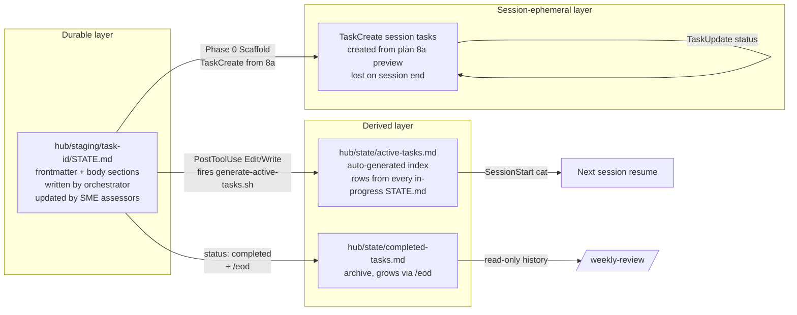
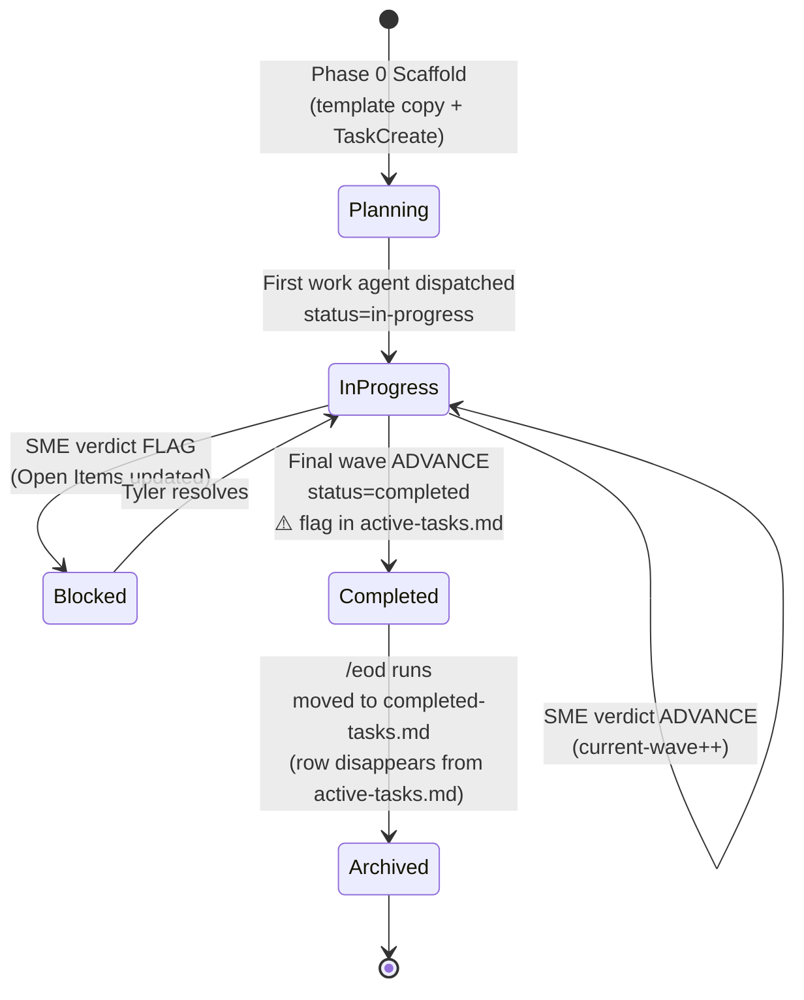

# Task State Management

> **How Morpheus tracks tasks across sessions — STATE.md as durable per-task source of truth, active-tasks.md as auto-generated cross-session index, Claude Code TaskCreate as ephemeral session view.**

## Overview

**What it is**: A three-layer task model with clearly separated write ownership per layer. **STATE.md** in `hub/staging/{task-id}/` is the durable per-task source of truth; `/the-protocol` creates it, SME assessors update it, `/eod` archives it. **active-tasks.md** in `hub/state/` is the auto-generated cross-session index — a one-line row per in-progress STATE.md, regenerated by a PostToolUse hook on every Edit/Write. **Claude Code TaskCreate** is the session-ephemeral view — populated at Phase 0 Scaffold from the plan's 8a preview, useful for in-session navigation, lost when the session ends. The three layers fail independently and heal independently, which is the point.

**Why it exists**: Sessions die but work continues. Without a durable STATE.md layer, every session start would be a cold start — no memory of which wave a task was on, which SME issued the last verdict, or which Open Items remain. Ultra-scope tasks spanning days or weeks would be impossible. The layer split also prevents coupling: if TaskCreate were durable, Morpheus would be hostage to Claude Code's harness evolution; if active-tasks.md were hand-maintained, it would drift from STATE.md within hours. Auto-generation keeps the derived view honest without requiring the LLM to remember to refresh it.

**Who uses it**: Every Morpheus skill that does work touches STATE.md (the orchestration loop's Gate 1 requires it before any work begins). Tyler reads `active-tasks.md` at session start to pick up where he left off (SessionStart hook prints it). The orchestration loop's Gate 3 (checkpoint after every phase) writes back to STATE.md. `/approve-pending`, `/eod`, `/catch-up`, and `/weekly-review` are the major skills that read the task-state model directly.

**Status**: `active` — production from initial Morpheus build (2026-03-30); active-tasks.md auto-generator added 2026-04-13.

## Architecture

Morpheus's task tracking has three layers with different durability guarantees. STATE.md files in `hub/staging/{task-id}/` are the durable source of truth — one per task, living documents that SME assessors update as waves complete. `hub/state/active-tasks.md` is a derived view auto-generated from every in-progress STATE.md frontmatter; it exists only as a fast cross-session index and is regenerated on every Edit/Write via PostToolUse hook. Claude Code's TaskCreate tool is the session-ephemeral view — populated from the plan's section 8a preview at task launch, used for in-session task-list navigation, and lost when the session ends.

### Three-layer state model



**What happens**: STATE.md is the only layer Morpheus writes to during normal execution — the other two are derived. active-tasks.md regenerates idempotently in ~100ms from `scripts/utils/generate-active-tasks.sh`; never edit it by hand (manual edits get overwritten on the next PostToolUse fire). completed-tasks.md accumulates via `/eod` archiving. TaskCreate is Claude Code's session task list — populated at Phase 0 Scaffold from the plan's 8a preview, mirrored against STATE.md's Task Table but not bound to it. Key rule: if STATE.md and TaskCreate disagree, STATE.md wins — TaskCreate is just a convenient view.

### STATE.md lifecycle



**What happens**: STATE.md transitions are driven by SME verdicts and Tyler gates. `status: planning` is the scaffold state — frontmatter written, Task Table seeded, no work begun. `status: in-progress` is everything from first dispatch to final ADVANCE. `status: blocked` is set by the orchestrator when an SME issues FLAG or when Tyler pauses work; active-tasks.md renders blocked tasks with a distinct marker. `status: completed` appears before archival and is visible in active-tasks.md with a ⚠️ flag because `/eod` hasn't moved the row yet. Running `/eod` is what archives — moves the STATE.md into `hub/state/completed-tasks.md` as a history row and removes the active-tasks.md entry. The ⚠️ lag is intentional: it prevents data loss if `/eod` hasn't run yet.

### Approval lifecycle (for /approve-pending)

```mermaid
flowchart TB
  A[High-risk cascade raised<br/>e.g. /ingest-context mass rename] --> B[AskUserQuestion:<br/>Apply / Defer / Deny]
  B -->|Apply now| C[Applied → ## Approvals Log ✓<br/>with timestamp]
  B -->|Deny| D[Denied → ## Approvals Log ✗<br/>with timestamp]
  B -->|Defer| E[Deferred → ## Approvals Pending<br/>checkbox: [ ]<br/>with task ref]

  E --> F{How resolved?}
  F -->|Tyler checks box<br/>in daily note| G[prompt-context-loader<br/>auto-fires /approve-pending]
  F -->|Tyler runs<br/>/approve-pending| H[Skill reads Approvals Pending]
  G --> I[AskUserQuestion re-prompt<br/>per deferred item]
  H --> I
  I -->|Apply| J[Move to ## Approvals Log ✓<br/>preserve original raised-timestamp]
  I -->|Deny| K[Move to ## Approvals Log ✗<br/>preserve original raised-timestamp]
  I -->|Defer again| E

  C --> L[Cascade executed]
  J --> L
  D --> M[Cascade blocked]
  K --> M
```

**What happens**: High-risk cascades (mass file renames, destructive ingest operations, anything Tyler should approve explicitly) land as `## Approvals Pending` entries in the daily note at the moment they're raised. Entries are always written with unchecked `- [ ]` boxes — Claude MUST NEVER auto-check. When Tyler checks the box in Obsidian, the daily-note-watch hook sees the toggle and prompt-context-loader auto-fires `/approve-pending` on the next prompt. The skill re-prompts with AskUserQuestion per deferred item; the answer moves the entry to `## Approvals Log` (immutable append-only) while preserving the original raise timestamp. Entries live in the day they were raised, not the day they're acted on — deferred items from Monday that get applied Thursday are logged in Monday's note. Rule: every approval entry must reference a session task via `(task: <id>)`; orphans are flagged as red-flag items.

## User flows

### Flow 1: /project-init — bootstrap a new task

**Goal**: create the full scaffold for a new task — staging dir, STATE.md, INDEX.md entry, daily note init — so work can begin through the orchestration loop.

**Steps**:
1. Tyler runs `/project-init` (or Morpheus fires it automatically via `/the-protocol` Step 7 for Medium+ scope).
2. Skill prompts via AskUserQuestion for task slug, scope tier, and macro goal.
3. `mkdir hub/staging/{YYYY-MM-DD-slug}/` (fails fast if slug collides — forces disambiguation).
4. Read `hub/templates/state.md`; substitute frontmatter (task-id, scope, status=planning, protocol, sub-protocol, created, last-updated, current-wave=0, current-round=0).
5. Populate body sections from context: Macro Goal (from Tyler's input), Task Table seeded from plan 8a if a plan exists, Context Inventory listing any pre-existing artifacts, Validation Framework from profile Acceptance Criteria Template.
6. Write STATE.md. PostToolUse hook regenerates `active-tasks.md` automatically — new row appears.
7. Prepend daily note timeline entry per Prepend Protocol.
8. INDEX.md auto-updated by `update-index.sh` on the Write.

**Example**:
```bash
/project-init
# AskUserQuestion: slug? "2026-04-20-sentinel-impossible-travel"
# AskUserQuestion: scope? Medium
# ...
# → hub/staging/2026-04-20-sentinel-impossible-travel/STATE.md created
# → active-tasks.md shows new row
# → daily note has init entry
```

**Expected result**: staging dir + STATE.md exist; active-tasks.md shows one new row; INDEX.md entry present; daily note has timestamped init entry. Ready for `/the-protocol` Step 8 handoff.

### Flow 2: /task-list-management — populate session TaskCreate from STATE.md

**Goal**: mirror STATE.md's Task Table into Claude Code's session task list so the in-session task UI reflects plan 8a structure.

**Steps**:
1. After Phase 0 Scaffold writes STATE.md, `/task-list-management` is invoked (either by `/the-protocol` Step 7d or manually).
2. Skill reads plan's section 8a preview (the hierarchical task list) and 8b dependency table.
3. For each phase in 8a: `TaskCreate` a top-level task, then nested subtasks.
4. For each dependency in 8b: `TaskUpdate(addBlockedBy)` to apply.
5. VERIFY and CHECKPOINT tasks inserted at end of each phase.
6. Session task list now matches the plan 1:1; Tyler can see phase progress at a glance.

**Example**:
```bash
/task-list-management sync 2026-04-20-sentinel-impossible-travel
# Reads plan section 8a
# TaskCreate: Phase 0, Phase 1, ..., Phase N + subtasks
# Apply blockedBy edges
# → 32 session tasks created, 41 blockedBy edges
```

**Expected result**: Claude Code session task list shows all phases with correct dependencies; ephemeral view matches durable STATE.md Task Table; TaskUpdate calls during execution keep both in sync.

### Flow 3: /approve-pending — walk the daily note approval backlog

**Goal**: process deferred high-risk cascades from today's or prior daily notes, moving each to applied or denied.

**Steps**:
1. Tyler either (a) checks a box in `## Approvals Pending` which triggers daily-note-watch → prompt-context-loader auto-fires `/approve-pending`, or (b) runs `/approve-pending` directly.
2. Skill reads today's daily note + last 3 days for `## Approvals Pending` entries.
3. For each entry: AskUserQuestion "Apply / Deny / Defer" with the cascade description + task ref.
4. On Apply: execute the cascade (e.g., run the mass rename); move entry to `## Approvals Log` with ✓ and current timestamp; preserve original raised timestamp parenthetically.
5. On Deny: move entry to `## Approvals Log` with ✗ and current timestamp; preserve original raised timestamp.
6. On Defer: leave entry in `## Approvals Pending` (re-prompt next time).
7. Receipts go to the day the entry was raised, not today — so historical notes stay chronologically accurate.

**Example**:
```bash
/approve-pending
# Reads notes/2026/04/2026-04-18.md → finds 2 Approvals Pending
# AskUserQuestion per item: Apply / Deny / Defer
# → 1 applied, 1 deferred
# Receipt appears in 2026-04-18 note's Approvals Log, not today's note
```

**Expected result**: deferred approvals resolved or knowingly deferred further; Approvals Log has correct receipts in the correct day's note; original raise timestamps preserved.

### Flow 4: Cross-session resume via active-tasks.md

**Goal**: start a new Claude Code session and immediately know which tasks are in-flight, at what wave, and what to do next.

**Steps**:
1. New session opens. SessionStart hook fires `cat hub/state/active-tasks.md` and prints the file to context.
2. Tyler sees one row per in-progress task: task-id, scope, status, current-wave/round, last-updated, Next Action.
3. Tyler picks up a task by asking Morpheus (e.g., "resume 2026-04-18-sentinel-build").
4. `/the-protocol` detects an existing STATE.md for the slug → skips new scaffold, reads existing STATE.md + HANDOFF.md (Ultra scope only).
5. `/orchestration-dispatch` picks up at current-wave / current-round.
6. Completion of the wave → CHECKPOINT updates STATE.md; PostToolUse hook regenerates active-tasks.md; the row updates.

**Example**:
```bash
# New session, 3 days after Ultra task paused
# SessionStart prints:
# | 2026-04-15-sentinel-platform | ultra | in-progress | W3R2 | 2026-04-18T17:30 | Finish detection #7 |
# Tyler: "resume 2026-04-15-sentinel-platform"
# → dispatch picks up at W3R2
```

**Expected result**: zero cold-start cost; every in-flight task is visible at a glance; resume is a one-line prompt.

## Configuration

| Path / Variable | Purpose | Default | Required? |
|-----------------|---------|---------|-----------|
| `hub/staging/{task-id}/STATE.md` | Per-task durable state (single source of truth) | created by `/project-init` or Phase 0 Scaffold | yes |
| `hub/staging/{task-id}/STATE.md.bak` | SME assessor backup before writing | created per SME update | optional |
| `hub/staging/{task-id}/STATE.md.v1.bak` | v1 backup produced by migrate-state-md-v2.ps1 | one-off migration; may be deleted post-verification | optional |
| `hub/staging/{task-id}/HANDOFF.md` | Cross-session resume packet (template: hub/templates/handoff.md) | required for Ultra; optional for Large | scope-gated |
| `hub/state/active-tasks.md` | Auto-generated cross-session index (DO NOT edit manually) | regenerated by PostToolUse hook | yes (auto) |
| `hub/state/completed-tasks.md` | Archive of finished tasks | grows via `/eod` | yes |
| `hub/state/harness-audit-ledger.md` | Append-only ledger of protocol invocations + gate pass/fail | auto-written by hooks | yes |
| `hub/templates/state.md` | Canonical STATE.md template (v2 frontmatter) | — | yes |
| `hub/templates/handoff.md` | Canonical HANDOFF.md template (schema v1) | — | yes |
| `.claude/hooks/state-frontmatter-validator.ps1` | PostToolUse(Edit|Write) — validates STATE.md v2 frontmatter; writes violation to audit ledger + daily note | registered in settings.local.json | yes |
| `.claude/hooks/handoff-validator.ps1` | SessionStart — validates HANDOFF.md schema on Ultra tasks; surfaces gaps | registered in settings.local.json | yes |
| `.claude/rules/active-tasks.md` | Rules governing auto-generation + manual-edit ban | — | yes |
| `.claude/rules/daily-note.md` § Approval Lifecycle | Approval state transitions + immutability rules | — | yes |
| `scripts/utils/generate-active-tasks.sh` | Generator script (~100ms, idempotent) | registered in PostToolUse | yes |
| `scripts/utils/migrate-state-md-v2.ps1` | One-shot migration script; upgraded 25 STATE.md files to v2 on 2026-04-22 | archived for reference | reference |

### STATE.md frontmatter — v2 schema

STATE.md frontmatter v2 (`schema-version: 2`) tightened the original 8 core fields and added 6 new machine-readable fields introduced by the 2026-04-22 overhaul.

**Core fields (present since v1):**

| Field | Type | Purpose |
|-------|------|---------|
| `task-id` | `YYYY-MM-DD-{slug}` | Matches staging dir name; idempotency key for Planner create |
| `scope` | mini/small/medium/large/ultra | Drives budget, sub-protocol, and HANDOFF requirement |
| `status` | planning/in-progress/blocked/completed | Drives active-tasks.md rendering |
| `protocol` | profile slug | For sub-protocol resolution |
| `sub-protocol` | sub-protocol slug | For wave sequence |
| `schema-version` | integer (must be `2`) | Migration contract; validator rejects v1 |
| `current-wave` / `current-round` | integer | Orchestration dispatch cursor |
| `created` / `last-updated` | ISO timestamp | Sort order + staleness detection |

**v2 machine-readable fields (new in 2026-04-22 overhaul):**

| Field | Type | Purpose |
|-------|------|---------|
| `planner-task-id` | GUID string or `null` | Planner task GUID recorded at Step 7.5; null for Mini/Small/Passthrough |
| `plan-approved-at` | ISO timestamp or `null` | Timestamp of `ExitPlanMode` for Medium+; null for Mini/Small (plan-first invariant evidence) |
| `pending-decisions` | list of `{id, title, options, blocking}` objects | Unresolved ADRs or open-design questions; mirrored to HANDOFF.md for Ultra |
| `blockers` | list of `{id, description, owner, unblock-criterion, first-seen}` objects | Anything preventing the next wave; mirrored to HANDOFF.md |
| `verified-artifacts` | list of `{path, verified-at, verified-by}` objects | Externally verified artifact inventory; only SME-assessed or test-passed artifacts belong here |
| `resume-command` | string | Literal command a new session can execute to resume; typically `/orchestration-dispatch hub/staging/{task-id}/STATE.md` |

Missing core fields fall back to safe defaults in the generator (`scope: unknown`, `status: unknown`, etc.) but `/orchestration-dispatch` treats unknown status as FLAG. Missing v2 fields are treated as malformed by `state-frontmatter-validator.ps1`, which writes a violation to the audit ledger and prepends a `#protocol-audit #violation` entry to today's daily note.

### Typed state vs narrative

STATE.md has two distinct surfaces with different purposes and different readers.

**Frontmatter** (YAML, machine-readable): the 14 fields above are the typed task state. They are read programmatically by `generate-active-tasks.sh` (for the cross-session index), `state-frontmatter-validator.ps1` (for schema validation), `/orchestration-dispatch` (for the Step 0 pre-launch gate), and the harness-metrics generator. Keep frontmatter tight and well-typed — it is the machine-checkable layer.

**Body sections** (Markdown, human-readable): Macro Goal, Project Scaffold, Task Table, Context Inventory, Validation Framework, Progress Summary, Open Items, Next Action are the narrative layer. They exist for human readability and for agents that need broader context. SME assessors write Progress Summary entries; the orchestrator writes the rest. Body sections should never be parsed programmatically — use frontmatter fields for machine-readable state.

The separation prevents the failure mode where a large body section inflates context cost every time the file is loaded. Agents reading STATE.md should load the frontmatter for status/cursor decisions and only read body sections when they need the full context for a new wave.

### Large-tier wave-ledger Task Table

For Large and Ultra scope, the Task Table uses an extended 11-column form that makes wave dependencies machine-checkable. The `/orchestration-dispatch` Step 0 gate reads `verification-status` before launching the next wave.

| ID | Task | Status | Wave | Agent | blockedBy | Required Inputs | Required Outputs | Blockers | Verification Status | Output |
|----|------|--------|------|-------|-----------|-----------------|------------------|----------|---------------------|--------|
| T1 | Research {topic} | ⬚ pending | W1 | gatherer | — | STATE.md | {path}.md w/ ≥N sources | — | ⬚ pending | research-{topic}.md |
| T2 | Plan {deliverable} | ⬚ pending | W2 | planner | T1 | T1 output path | 16-section plan | — | ⬚ pending | plan-{deliverable}.md |

The four new columns:
- **Required Inputs**: paths (or descriptions) that must exist before this task can launch. The gate verifies existence via `test -f`.
- **Required Outputs**: what the task must produce. The gate checks these exist post-execution.
- **Blockers**: cross-reference to `blockers` frontmatter list entries by ID, or "—" if none.
- **Verification Status**: `⬚ pending` → `✅ PASS` or `❌ FAIL` after the SME assessor runs. **The next wave cannot launch until the prior wave's `verification-status` is `PASS`.**

### HANDOFF v1 schema

HANDOFF.md is the cross-session resume packet for Ultra tasks. A fresh Morpheus instance reading only HANDOFF.md + STATE.md must be able to resume work with no missing intent, blockers, or next step. Template: `hub/templates/handoff.md`.

**When required vs optional:**
- **Ultra scope**: HANDOFF.md is **required**. It must be created as part of Wave 0 before any Wave 1 launches. Validated on session start by `handoff-validator.ps1`.
- **Large scope**: HANDOFF.md is **optional but recommended** for tasks that span more than one session. If the task stays within a single session, it may be omitted. If a second session starts without it, `handoff-validator.ps1` emits a non-blocking warning.
- **Medium and below**: HANDOFF.md is not applicable. Use STATE.md body sections for any cross-session context.

**The 7 sections of the HANDOFF v1 schema:**

| Section | Purpose | Mutability |
|---------|---------|------------|
| `## Intent` | Verbatim copy of STATE.md Macro Goal. Never paraphrased. Intent must not drift across sessions. | Immutable once set |
| `## Pending Decisions` | Unresolved ADRs with options, why-it-matters, and blocking status. Rows resolved inline; never deleted. | Rows resolved inline |
| `## Active Blockers` | Anything preventing the next wave. Each entry: owner + unblock criterion + first-seen timestamp. | Rows pruned when unblocked |
| `## Verified Artifacts` | Externally verified artifacts only (SME-assessed or test-run-passed). Each row: path + verified-at + verified-by. Unverified artifacts do NOT belong here. | Append-only |
| `## Next Command` | Literal command a new session can execute to resume. Copy-paste ready. If Tyler decision required, names the Decision ID. | Updated at each session boundary |
| `## Planner Links` | Personal and project board Planner task IDs + URLs + last-sync timestamp. | Updated on each sync |
| `## Resume Checklist` | 10-point human-walkable verification a fresh session agent must walk through before proceeding. If ANY item fails, surface to Tyler via AskUserQuestion. | Static template; boxes checked at each resume |

### How /orchestration-dispatch validates STATE.md at Step 0

Before dispatching any work agent, `/orchestration-dispatch` runs a pre-launch gate (Step 0) that validates STATE.md is in a launchable state. The checks are:

1. **Schema version**: `schema-version` must be `2`. v1 STATE.md files fail this check — run `migrate-state-md-v2.ps1` to upgrade.
2. **Status check**: `status` must be `in-progress` or `planning`. `blocked` triggers FLAG to Tyler; `completed` triggers an error (should have been archived via `/eod`).
3. **Plan-approval gate**: for `scope` in {medium, large, ultra}: `plan-approved-at` must be non-null. A null value means scaffolding happened before plan approval — a violation of the plan-first invariant. The gate writes a FAIL entry to the harness-audit ledger.
4. **Wave-ledger gate** (Large/Ultra only): the prior wave's Task Table rows must all have `verification-status = PASS`. Any pending or FAIL in the prior wave blocks the current wave from launching.
5. **HANDOFF gate** (Ultra only): if `current-wave > 0`, a HANDOFF.md must exist at `hub/staging/{task-id}/HANDOFF.md`. Missing HANDOFF on a running Ultra task triggers FLAG to Tyler.

All gate results are written to `hub/state/harness-audit-ledger.md` and — on failure — prepended to today's daily note tagged `#protocol-audit #violation`.

### Migration: v1 → v2 (2026-04-22)

On 2026-04-22, all existing STATE.md files in `hub/staging/` were migrated from v1 to v2 frontmatter using `scripts/utils/migrate-state-md-v2.ps1`. The migration:
- Added all 6 new v2 fields with safe defaults (nullable fields set to `null` or `[]`)
- Set `schema-version: 2` on every migrated file
- Backed up each original file as `{filename}.v1.bak` (e.g., `STATE.md.v1.bak`) before writing

25 STATE.md files were migrated. The `.v1.bak` backups remain in place for disaster recovery and may be cleaned up manually after confirming the migrated files are correct. The migration script is archived at `scripts/utils/migrate-state-md-v2.ps1` for reference.

## Integration points

| Touches | How | Files |
|---------|-----|-------|
| Orchestration loop | Every wave reads Macro Goal + Task Table + Next Action; SME assessors write Progress + Artifacts + verdicts | `docs/morpheus-features/orchestration-loop.md`, `.claude/rules/hub.md` |
| PostToolUse hook | `generate-active-tasks.sh` regenerates `active-tasks.md` from every STATE.md frontmatter change | `scripts/utils/generate-active-tasks.sh`, `.claude/settings.local.json` |
| SessionStart hook | `cat hub/state/active-tasks.md` surfaces cross-session state into context | `.claude/settings.local.json` SessionStart block |
| Daily note | `## Approvals Pending` (deferred) + `## Approvals Log` (immutable) + timeline entries per phase checkpoint | `.claude/rules/daily-note.md`, `notes/YYYY/MM/YYYY-MM-DD.md` |
| Planner sync | `planner-push-queue-writer.sh` diffs STATE.md status/priority into push queue on every Edit/Write | `.claude/hooks/planner-push-queue-writer.sh`, `hub/state/planner-push-queue.json` |
| /eod skill | Archives `status: completed` rows from active-tasks.md to completed-tasks.md | `.claude/commands/eod.md` |
| /catch-up skill | Reads active-tasks.md + completed-tasks.md to summarize missed days | `.claude/commands/catch-up.md` |

## Troubleshooting

| Symptom | Likely cause | Fix |
|---------|-------------|-----|
| active-tasks.md doesn't reflect latest STATE.md change | Stale active-tasks.md — generator hook didn't fire or failed silently (observed) | Run `bash scripts/utils/generate-active-tasks.sh` directly. If it errors, read stderr — usually missing bash 4+ features or permission on `hub/state/`. Confirm the PostToolUse hook entry in `.claude/settings.local.json` is registered and not timing out. |
| STATE.md fails orchestration dispatch | STATE.md frontmatter drift — missing required v2 field or schema-version mismatch | Read `hub/templates/state.md`; diff against your STATE.md frontmatter. All 10 core fields must be present plus the 6 v2 fields (planner-task-id, plan-approved-at, pending-decisions, blockers, verified-artifacts, resume-command). If `schema-version` is missing or `1`, run `scripts/utils/migrate-state-md-v2.ps1` to upgrade. `state-frontmatter-validator.ps1` prepends a daily note violation entry identifying the specific missing fields. |
| Approval entry has no task reference | Orphaned approval — missing `(task: <id>)` ref (theoretical) | Flag to Tyler before acting. Do not auto-remove orphans; they may represent a raised cascade from a crashed session. Reconcile by searching git log or hub/staging for matching timestamp. |
| Two staging dirs for the same day can't resolve | Task ID slug collision (theoretical) | `/project-init` fails fast on collision. If somehow two slugs merged: inspect both STATE.md files, keep the one with more Progress Summary entries, rename the other to `{slug}-v2`, update active-tasks.md + INDEX.md by hand. |
| active-tasks.md shows ⚠️ on completed task | Status flipped to `completed` but `/eod` not yet run | Expected transient state. Run `/eod` to archive; the row moves to completed-tasks.md and disappears from active-tasks.md. The ⚠️ is intentional to prevent silent data loss. |
| STATE.md.bak clutter | SME assessors back up before write — `.bak` files accumulate | Safe to delete after a successful CHECKPOINT. If the Progress Summary shows ADVANCE, the `.bak` is no longer needed. Hook could auto-clean but intentional manual retention for disaster recovery. |

## References

**Skills**:
- [`.claude/commands/project-init.md`](../../.claude/commands/project-init.md) — scaffolds STATE.md + staging dir
- [`.claude/commands/task-list-management.md`](../../.claude/commands/task-list-management.md) — syncs TaskCreate to plan 8a
- [`.claude/commands/approve-pending.md`](../../.claude/commands/approve-pending.md) — walks daily note approval backlog
- [`.claude/commands/eod.md`](../../.claude/commands/eod.md) — archives completed STATE.md → completed-tasks.md
- [`.claude/commands/catch-up.md`](../../.claude/commands/catch-up.md) — summarizes missed days from active + completed

**Rules**:
- [`.claude/rules/active-tasks.md`](../../.claude/rules/active-tasks.md) — auto-generation rules + manual-edit ban
- [`.claude/rules/daily-note.md`](../../.claude/rules/daily-note.md) § Approval Lifecycle — approval immutability + transition rules
- [`.claude/rules/hub.md`](../../.claude/rules/hub.md) § STATE.md Update Mandate — when STATE.md must be updated
- [`.claude/rules/implementation-plan-standard.md`](../../.claude/rules/implementation-plan-standard.md) — plan 8a ↔ STATE.md Task Table relationship

**Templates + generated state**:
- [`hub/templates/state.md`](../../hub/templates/state.md) — canonical STATE.md template (v2 frontmatter)
- [`hub/templates/handoff.md`](../../hub/templates/handoff.md) — HANDOFF v1 schema template
- [`hub/state/active-tasks.md`](../../hub/state/active-tasks.md) — current auto-generated index
- [`hub/state/completed-tasks.md`](../../hub/state/completed-tasks.md) — archive
- [`hub/state/harness-audit-ledger.md`](../../hub/state/harness-audit-ledger.md) — protocol invocation audit log
- [`scripts/utils/generate-active-tasks.sh`](../../scripts/utils/generate-active-tasks.sh) — generator (~100ms, idempotent)
- [`scripts/utils/migrate-state-md-v2.ps1`](../../scripts/utils/migrate-state-md-v2.ps1) — one-shot v1→v2 migration (archived)

**Hooks**:
- [`.claude/hooks/state-frontmatter-validator.ps1`](../../.claude/hooks/state-frontmatter-validator.ps1) — PostToolUse validator for STATE.md v2 schema
- [`.claude/hooks/handoff-validator.ps1`](../../.claude/hooks/handoff-validator.ps1) — SessionStart validator for HANDOFF.md

**Spec**:
- [`docs/reference/state-file-spec.md`](../reference/state-file-spec.md) — detailed STATE.md field reference

**Related feature docs**:
- [`docs/morpheus-features/orchestration-loop.md`](orchestration-loop.md) — the primary consumer of STATE.md
- [`docs/morpheus-features/daily-notes-system.md`](daily-notes-system.md) — Approvals Pending / Approvals Log surface
- [`docs/morpheus-features/hooks-framework.md`](hooks-framework.md) — generate-active-tasks.sh PostToolUse registration
- [`docs/morpheus-features/north-star-standard.md`](north-star-standard.md) — 8 invariants + metrics this feature helps enforce

## Changelog

| Timestamp | Project | Agent | Change |
|-----------|---------|-------|--------|
| 2026-04-22 | 2026-04-22-harness-intake-improvements | documenter | v2 overhaul update: added STATE.md v2 schema section (14 fields: 8 core + 6 new v2); added Typed state vs narrative subsection; added Large-tier wave-ledger Task Table section; added HANDOFF v1 schema section (7 sections, required/optional scope rules); added How /orchestration-dispatch validates STATE.md at Step 0 (5 gates); added Migration v1→v2 section (25 files via migrate-state-md-v2.ps1); expanded Configuration to 15 rows; updated Troubleshooting STATE.md row; added Hooks subsection + north-star to References. |
| 2026-04-20 | 2026-04-17-feature-docs-prose-fill | morpheus | Filled skeleton to active: 3 Mermaid (3-layer state model, STATE.md lifecycle, approval lifecycle), Configuration expanded to 8 rows + required-field table, Integration points to 7 rows, 4 user flows (project-init, task-list-management, approve-pending, cross-session resume) with full Goal/Steps/Example/Expected structure, 6-row troubleshooting with stale active-tasks.md flagged as the observed failure, References split into 5 named subsections. |
| 2026-04-17T11:00 | 2026-04-17-morpheus-feature-docs | morpheus | Skeleton created via /document-feature audit consolidation — prose TODO |
